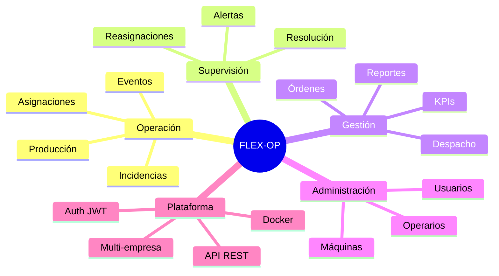

# Capítulo 3 — Planteamiento del problema

[← Índice](./README.md) | [← Anterior](./02-introduccion.md) | [Siguiente →](./04-objetivos.md)

---

> **Aviso:** No existe un documento de levantamiento de requerimientos con entrevistas o visitas en el repositorio. Este capítulo describe la **situación operativa que el software fue diseñado para atender**, inferida del dominio implementado.

## Situación actual (sin sistema — contraste con lo implementado)

| Aspecto | Situación problemática típica | Lo que el código resuelve |
|---------|------------------------------|---------------------------|
| Asignaciones | Registro manual, sin control de exclusividad | `Asignacion.clean()` valida una máquina/operario activo; `iniciar()`/`finalizar()` transaccionales |
| Producción | Sin consolidación por turno | `RegistroProduccion` ligado a `Asignacion` |
| Incidencias | Sin seguimiento de estado | Estados ABIERTA → EN_PROCESO → RESUELTA / ESCALADA |
| Eficiencia | Cálculo manual | `MetricaEficiencia.calcular_para_asignacion()` con descuento de pausas |
| Alertas | Reactivas | `ReglaAlerta` con 4 tipos evaluables automáticamente |
| Órdenes | Sin cola de despacho | `ColaDespacho` con orden por prioridad (`ordenes/ordering.py`) |
| Reportes | Sin historial | `ReporteGenerado` + exportación CSV |
| Usuarios | Sin control por rol | JWT + 6 clases de permiso DRF |

## Problemas identificados (evidenciados por reglas de negocio en código)

| ID | Problema | Evidencia técnica |
|----|----------|-------------------|
| P01 | Doble uso de máquina u operario en tareas activas | Validación en `Asignacion.clean()` y `iniciar()` |
| P02 | Pérdida de trazabilidad de pausas | Modelo `Evento` con tipos PAUSA/REANUDACION; `metricas/efficiency.py` |
| P03 | Incidencias sin escalamiento | `Incidencia.escalar()` notifica a usuarios GERENTE |
| P04 | Datos mezclados entre empresas | `EmpresaFilterMixin`, `validate_same_empresa()` |
| P05 | Acceso no autorizado por rol | `permissions.py`, `canAccessPath()` en frontend |
| P06 | Cola de despacho desordenada | Pesos de prioridad URGENTE→BAJA unificados |
| P07 | Alertas duplicadas | `_crear_alerta_activa()` con `get_or_create` transaccional |
| P08 | Consultas lentas en listados | Módulos `querysets.py` en operaciones, metricas, alertas |

## Necesidades que cubre el sistema

