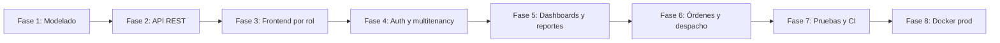

# Capítulo 6 — Metodología

[← Índice](./README.md) | [← Anterior](./05-alcance.md) | [Siguiente →](./07-requerimientos.md)

---

> **Aviso:** No existe en el repositorio un documento que declare formalmente Scrum, XP, Cascada u otra metodología ADSO. Este capítulo describe el **enfoque de desarrollo inferido** de la estructura del código, pruebas e infraestructura.

## Metodología identificada (inferida)

| Práctica | Evidencia en el repositorio |
|----------|----------------------------|
| **Desarrollo incremental por módulos** | 8 apps Django independientes con `urls.py`, `models.py`, `views.py` propios |
| **API First / separación frontend-backend** | Backend solo REST; frontend Next.js sin templates Django |
| **Integración continua** | `.github/workflows/backend-tests.yml` en push/PR |
| **Pruebas automatizadas en capas** | Unitarias (pytest, Vitest), integración (MSW), E2E (Playwright) |
| **Infraestructura como código** | `docker-compose.yml`, Dockerfiles, entrypoint |
| **Seed de datos para demos** | `populate_db.py` idempotente |
| **Refactorización por auditoría** | Módulos `querysets.py`, `ordering.py`, `efficiency.py` (optimización documentada en tests) |

No se evidencia uso de tableros Kanban, sprints documentados ni actas en el repositorio.

## Fases ejecutadas (reconstruidas desde artefactos)

| Fase | Entregables detectados |
|------|------------------------|
| 1 — Modelado | Migraciones `0001_initial` en todas las apps; modelos con métodos de negocio |
| 2 — API | ViewSets, serializers, `ENDPOINTS.md` por módulo |
| 3 — Frontend | 17 páginas en `src/app/`, componentes shadcn |
| 4 — Seguridad | JWT, permissions, `test_multitenancy.py`, `test_security_writes.py` |
| 5 — Analítica | `reportes/views.py` dashboards, Recharts en gerente |
| 6 — Producción planificada | App `ordenes`, cola despacho, tests ordering/despacho |
| 7 — Calidad | 31 archivos pytest, 22+ tests Vitest, 2 specs Playwright |
| 8 — Despliegue | `Dockerfile.prod`, WhiteNoise, `collectstatic` en entrypoint |

## Herramientas de gestión de calidad

| Herramienta | Uso |
|-------------|-----|
| pytest + pytest-cov | Backend; umbral CI ≥30% |
| Vitest + coverage-v8 | Frontend; umbral 70% statements/lines |
| Playwright | E2E login, navegación, logout |
| flake8 / black | En requirements (herramientas CLI, sin config en repo) |
