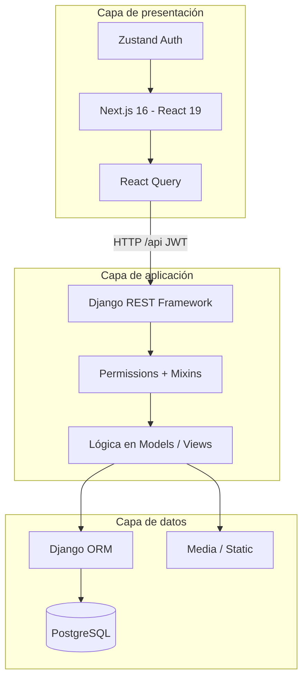
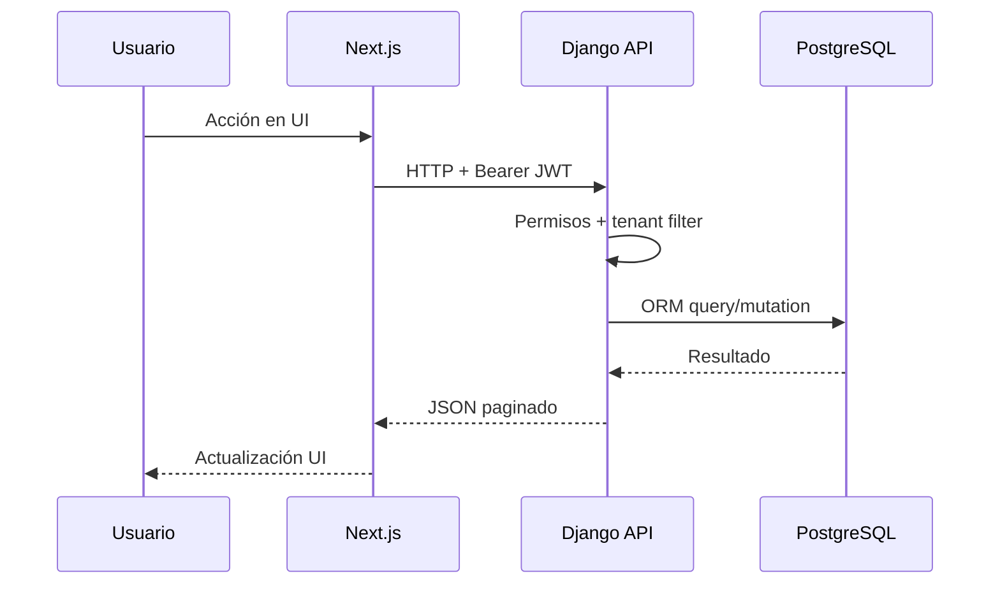
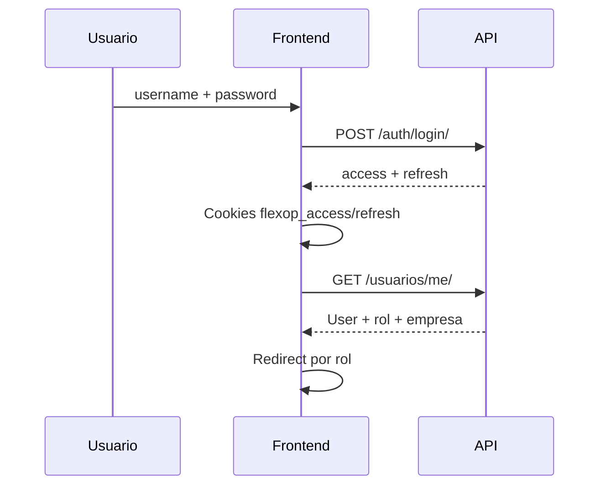

# Capítulo 8 — Arquitectura del sistema

[← Índice](./README.md) | [← Anterior](./07-requerimientos.md) | [Siguiente →](./09-tecnologias.md)

---

## Arquitectura general

**Patrón:** Cliente-Servidor en **3 capas** con API REST como frontera.

## Componentes principales

| Componente | Tecnología | Responsabilidad |
|------------|------------|-----------------|
| Cliente web | Next.js App Router | UI, routing, proxy API |
| Cliente HTTP | Axios + interceptors | JWT, refresh automático |
| Estado servidor | TanStack React Query | Cache, polling, mutaciones |
| API | Django + DRF | CRUD, acciones, validación |
| Auth | SimpleJWT + blacklist | Tokens access/refresh |
| Persistencia | PostgreSQL / SQLite | Datos transaccionales |
| Archivos | FileField/ImageField | Logos, reportes, perfiles |
| Estáticos prod | WhiteNoise | CSS/JS admin y DRF |
| Contenedores | Docker Compose | Orquestación local/prod |
| CI | GitHub Actions | Verificación automática |

## Flujo de información

### Flujo de autenticación

## Patrones de diseño utilizados

| Patrón | Ubicación | Propósito |
|--------|-----------|-----------|
| **MVC / MVT (Django)** | Models, Views, URLs | Separación backend |
| **Repository-like (Querysets)** | `*/querysets.py` | Optimización de consultas |
| **Mixin** | `EmpresaFilterMixin`, `EmpresaPerformCreateMixin` | Cross-cutting tenant |
| **ViewSet + Router** | Todas las apps | REST uniforme |
| **Custom actions** | `@action` en ViewSets | Operaciones de negocio |
| **SPA + BFF proxy** | `middleware.ts` | Unificar origen `/api` |
| **Observer-like (polling)** | React Query `refetchInterval` | Actualización periódica |
| **State management** | Zustand persist | Sesión de usuario |

**No evidenciado en código:** microservicios, event-driven (Celery sin usar), CQRS, GraphQL.
