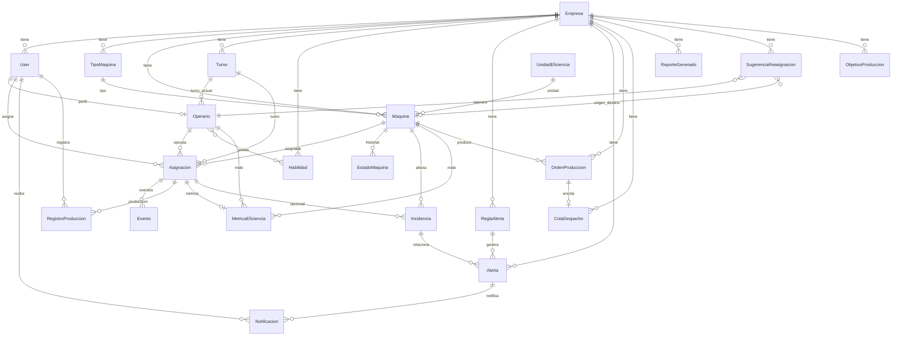

# Capítulo 10 — Modelo de datos

[← Índice](./README.md) | [← Anterior](./09-tecnologias.md) | [Siguiente →](./11-modulos.md)

---

## Diagrama entidad-relación

## Entidades (22 modelos)

### usuarios

| Modelo | Tabla | Descripción |
|--------|-------|-------------|
| `Empresa` | `empresas` | Tenant: datos legales, logo, estado activo |
| `User` | `usuarios` | Usuario del sistema con rol y FK a empresa |

### maquinas

| Modelo | Tabla | Descripción |
|--------|-------|-------------|
| `TipoMaquina` | `tipos_maquina` | Clasificación de equipos |
| `UnidadEficiencia` | `unidades_eficiencia` | Unidad de medida de capacidad |
| `Maquina` | `maquinas` | Equipo productivo con estado actual |
| `EstadoMaquina` | — | Historial de cambios de estado |

### operaciones

| Modelo | Tabla | Descripción |
|--------|-------|-------------|
| `Turno` | — | Franja horaria de trabajo |
| `Habilidad` | — | Competencia del operario; M2M tipos máquina |
| `Operario` | — | Perfil 1:1 de usuario OPERARIO |
| `Asignacion` | — | Tarea operario–máquina con ciclo de vida |
| `Evento` | — | Log INICIO/FIN/PAUSA/REANUDACION |
| `Incidencia` | — | Problema reportado en planta |

### metricas

| Modelo | Tabla | Descripción |
|--------|-------|-------------|
| `RegistroProduccion` | — | Cantidad producida por asignación |
| `MetricaEficiencia` | — | Eficiencia calculada; única por asignación |
| `ObjetivoProduccion` | — | Meta por máquina, turno u operario |

### alertas

| Modelo | Tabla | Descripción |
|--------|-------|-------------|
| `ReglaAlerta` | — | Condición configurable con umbral |
| `Alerta` | — | Instancia activa/resuelta de una regla |
| `Notificacion` | — | Mensaje al usuario |

### reasignaciones

| Modelo | Tabla | Descripción |
|--------|-------|-------------|
| `SugerenciaReasignacion` | — | Propuesta de mover operario a otra máquina |

### reportes

| Modelo | Tabla | Descripción |
|--------|-------|-------------|
| `ReporteGenerado` | — | Archivo exportado con metadatos JSON |

### ordenes

| Modelo | Tabla | Descripción |
|--------|-------|-------------|
| `OrdenProduccion` | — | Pedido de fabricación con prioridad |
| `ColaDespacho` | — | Cola FIFO ponderada por prioridad |

## Migraciones por aplicación

| App | Archivos de migración |
|-----|----------------------|
| usuarios | `0001_initial`, `0002_fix_bugs` |
| maquinas | `0001_initial`, `0002_initial` |
| operaciones | `0001_initial`, `0002_initial`, `0003_asignacion_evento_incidencia_and_more` |
| ordenes | `0001_initial` |
| metricas | `0001_initial`, `0002_initial`, `0003_unique_metrica_asignacion` |
| alertas | `0001_initial`, `0002_initial`, `0003_fix_bugs` |
| reasignaciones | `0001_initial` |
| reportes | `0001_initial` |

## Enumeraciones principales (choices en código)

| Modelo | Campo | Valores |
|--------|-------|---------|
| User | rol | OPERARIO, SUPERVISOR, GERENTE, ADMIN |
| Asignacion | estado | PENDIENTE, ACTIVA, COMPLETADA, CANCELADA |
| Maquina | estado_actual | DISPONIBLE, OPERANDO, MANTENIMIENTO, PARADA, FUERA_SERVICIO |
| Incidencia | tipo | FALLA_MAQUINA, FALTA_MATERIAL, PROBLEMA_CALIDAD, OTRO |
| Incidencia | prioridad | BAJA, MEDIA, ALTA, CRITICA |
| Incidencia | estado | ABIERTA, EN_PROCESO, RESUELTA, ESCALADA |
| OrdenProduccion | prioridad | BAJA, NORMAL, ALTA, URGENTE |
| OrdenProduccion | estado | PENDIENTE, EN_PROCESO, LISTA, DESPACHADA, CANCELADA |
| SugerenciaReasignacion | estado | PENDIENTE, ACEPTADA, RECHAZADA, EXPIRADA |
