# Capítulo 12 — Casos de uso

[← Índice](./README.md) | [← Anterior](./11-modulos.md) | [Siguiente →](./13-seguridad.md)

---

## Diagrama de casos de uso

```mermaid
flowchart TB
  subgraph actores [Actores]
    OP((Operario))
    SU((Supervisor))
    GE((Gerente))
    AD((Admin))
    SYS((Sistema))
  end
  subgraph operario_uc [Operario]
    UC003[Ver dashboard]
    UC004[Iniciar tarea]
    UC005[Finalizar tarea]
    UC006[Registrar producción]
    UC007[Reportar incidencia]
  end
  subgraph supervisor_uc [Supervisor]
    UC009[Ver dashboard supervisor]
    UC010[Resolver alerta]
    UC012[Aceptar sugerencia]
    UC014[Crear asignación]
    UC016[Resolver incidencia]
  end
  subgraph gerente_uc [Gerente]
    UC017[Ver dashboard gerente]
    UC018[Exportar CSV]
    UC021[Crear orden]
    UC023[Despachar cola]
  end
  subgraph admin_uc [Admin]
    UC024[Gestionar usuarios]
    UC025[Gestionar máquinas]
  end
  OP --> UC003 & UC004 & UC005 & UC006 & UC007
  SU --> UC009 & UC010 & UC012 & UC014 & UC016
  GE --> UC017 & UC018 & UC021 & UC023
  AD --> UC024 & UC025
  SYS --> UC038[Evaluar reglas alerta]
  SYS --> UC044[Generar sugerencias]
```

---

## CU001 — Iniciar sesión

| Campo | Descripción |
|-------|-------------|
| **Actor** | Cualquier usuario registrado y activo |
| **Descripción** | El usuario ingresa credenciales y obtiene tokens JWT para acceder al sistema |
| **Precondiciones** | Usuario existe, `activo=True` |
| **Flujo principal** | 1. Usuario accede a `/login`. 2. Ingresa username y password. 3. Frontend envía `POST /api/auth/login/`. 4. API valida y retorna access + refresh. 5. Se guardan cookies y se consulta `/api/usuarios/me/`. 6. Redirección al dashboard según rol |
| **Postcondiciones** | Sesión autenticada; tokens en cookies |

## CU002 — Cerrar sesión

| Campo | Descripción |
|-------|-------------|
| **Actor** | Usuario autenticado |
| **Descripción** | Invalida refresh token y limpia sesión local |
| **Precondiciones** | Usuario autenticado |
| **Flujo principal** | 1. Usuario pulsa Cerrar sesión en TopBar. 2. `POST /api/auth/logout/` con refresh. 3. Se limpian cookies y store |
| **Postcondiciones** | Usuario en `/login` |

## CU003 — Consultar dashboard operario

| Campo | Descripción |
|-------|-------------|
| **Actor** | Operario |
| **Descripción** | Visualiza KPIs del día y asignación activa/pendiente |
| **Precondiciones** | Rol OPERARIO, autenticado |
| **Flujo principal** | 1. Accede a `/operario`. 2. Frontend consulta `GET /api/dashboard/operario/` (poll 30s). 3. Muestra producción del día, objetivo, asignación |
| **Postcondiciones** | Dashboard actualizado |

## CU004 — Iniciar tarea asignada

| Campo | Descripción |
|-------|-------------|
| **Actor** | Operario (propia asignación) o Supervisor |
| **Descripción** | Cambia asignación de PENDIENTE a ACTIVA |
| **Precondiciones** | Asignación PENDIENTE; operario con habilidad; máquina disponible |
| **Flujo principal** | 1. Usuario pulsa Iniciar. 2. `POST /api/asignaciones/{id}/iniciar/`. 3. Modelo valida exclusividad, actualiza máquina a OPERANDO, crea Evento INICIO |
| **Postcondiciones** | Asignación ACTIVA |

## CU005 — Finalizar tarea

| Campo | Descripción |
|-------|-------------|
| **Actor** | Operario o Supervisor |
| **Descripción** | Completa asignación activa |
| **Precondiciones** | Asignación ACTIVA |
| **Flujo principal** | 1. Pulsa Finalizar. 2. `POST .../finalizar/`. 3. Estado COMPLETADA; libera máquina si no hay otra activa; incrementa contador operario; puede disparar cálculo métrica |
| **Postcondiciones** | Asignación COMPLETADA |

## CU006 — Registrar producción

| Campo | Descripción |
|-------|-------------|
| **Actor** | Operario |
| **Descripción** | Registra cantidad producida en asignación activa |
| **Precondiciones** | Asignación activa del operario |
| **Flujo principal** | 1. En `/operario/produccion` abre diálogo Registrar. 2. Ingresa cantidad y observaciones. 3. `POST /api/produccion/` con `asignacion` activa |
| **Postcondiciones** | Nuevo `RegistroProduccion` |

## CU007 — Reportar incidencia

| Campo | Descripción |
|-------|-------------|
| **Actor** | Operario |
| **Descripción** | Reporta problema en planta |
| **Precondiciones** | Autenticado como OPERARIO |
| **Flujo principal** | 1. En `/operario/incidencias` abre formulario. 2. Selecciona máquina, tipo, prioridad, título, descripción. 3. `POST /api/incidencias/` |
| **Postcondiciones** | Incidencia ABIERTA creada |

## CU008 — Consultar incidencias propias

| Campo | Descripción |
|-------|-------------|
| **Actor** | Operario |
| **Descripción** | Lista incidencias reportadas (paginado) |
| **Precondiciones** | Autenticado |
| **Flujo principal** | 1. Accede a incidencias. 2. `GET /api/incidencias/?page=N` |
| **Postcondiciones** | Listado mostrado |

## CU009 — Consultar dashboard supervisor

| Campo | Descripción |
|-------|-------------|
| **Actor** | Supervisor |
| **Descripción** | KPIs operativos, alertas y sugerencias resumidas |
| **Precondiciones** | Rol SUPERVISOR |
| **Flujo principal** | 1. `/supervisor`. 2. `GET /api/dashboard/supervisor/` + alertas activas + sugerencias pendientes |
| **Postcondiciones** | Vista consolidada |

## CU010 — Resolver alerta

| Campo | Descripción |
|-------|-------------|
| **Actor** | Supervisor |
| **Descripción** | Marca alerta como resuelta |
| **Precondiciones** | Alerta ACTIVA |
| **Flujo principal** | 1. En alertas pulsa Resolver. 2. `POST /api/alertas/{id}/resolver/` |
| **Postcondiciones** | Alerta RESUELTA |

## CU011 — Resolver todas las alertas activas

| Campo | Descripción |
|-------|-------------|
| **Actor** | Supervisor |
| **Descripción** | Resolución en lote |
| **Precondiciones** | Hay alertas ACTIVA |
| **Flujo principal** | 1. Pulsa Resolver todas. 2. Frontend ejecuta `Promise.allSettled` sobre cada alerta activa |
| **Postcondiciones** | Alertas resueltas; cache invalidado |

## CU012 — Aceptar sugerencia de reasignación

| Campo | Descripción |
|-------|-------------|
| **Actor** | Supervisor |
| **Descripción** | Aplica reasignación propuesta por el sistema |
| **Precondiciones** | Sugerencia PENDIENTE |
| **Flujo principal** | 1. En sugerencias pulsa Aceptar. 2. `POST /api/sugerencias/{id}/aceptar/`. 3. Modelo crea nueva Asignacion |
| **Postcondiciones** | Sugerencia ACEPTADA; nueva asignación |

## CU013 — Rechazar sugerencia

| Campo | Descripción |
|-------|-------------|
| **Actor** | Supervisor |
| **Descripción** | Descarta sugerencia |
| **Precondiciones** | Sugerencia PENDIENTE |
| **Flujo principal** | 1. Pulsa Rechazar. 2. `POST .../rechazar/` |
| **Postcondiciones** | Sugerencia RECHAZADA |

## CU014 — Crear asignación

| Campo | Descripción |
|-------|-------------|
| **Actor** | Supervisor |
| **Descripción** | Asigna operario a máquina y turno |
| **Precondiciones** | Rol SUPERVISOR+ |
| **Flujo principal** | 1. En asignaciones abre diálogo. 2. Selecciona operario, máquina, turno, fecha. 3. `POST /api/asignaciones/` |
| **Postcondiciones** | Asignación PENDIENTE |

## CU015 — Gestionar ciclo de asignación (supervisor)

| Campo | Descripción |
|-------|-------------|
| **Actor** | Supervisor |
| **Descripción** | Iniciar o finalizar asignaciones desde listado |
| **Precondiciones** | Asignación en estado válido |
| **Flujo principal** | Igual CU004/CU005 desde `/supervisor/asignaciones` |
| **Postcondiciones** | Estado actualizado |

## CU016 — Resolver incidencia

| Campo | Descripción |
|-------|-------------|
| **Actor** | Supervisor |
| **Descripción** | Cierra incidencia con solución |
| **Precondiciones** | Incidencia no RESUELTA |
| **Flujo principal** | 1. Abre diálogo en incidencias supervisor. 2. Ingresa solución. 3. `POST /api/incidencias/{id}/resolver/` |
| **Postcondiciones** | Incidencia RESUELTA |

## CU017 — Consultar dashboard gerente

| Campo | Descripción |
|-------|-------------|
| **Actor** | Gerente |
| **Descripción** | KPIs estratégicos y gráficos |
| **Precondiciones** | Rol GERENTE |
| **Flujo principal** | 1. `/gerente`. 2. `GET /api/dashboard/gerente/` (poll 60s). 3. Render Recharts |
| **Postcondiciones** | Dashboard mostrado |

## CU018 — Exportar reporte CSV

| Campo | Descripción |
|-------|-------------|
| **Actor** | Gerente |
| **Descripción** | Descarga CSV de eficiencia últimos 7 días |
| **Precondiciones** | Rol GERENTE+ |
| **Flujo principal** | 1. En reportes pulsa Exportar CSV. 2. `GET /api/exportar-csv/?tipo=eficiencia&fecha_inicio&fecha_fin`. 3. Blob descargado vía `downloadBlob` |
| **Postcondiciones** | Archivo CSV en cliente |

## CU019 — Descargar reporte generado

| Campo | Descripción |
|-------|-------------|
| **Actor** | Gerente |
| **Descripción** | Descarga archivo de reporte del historial |
| **Precondiciones** | Reporte con `archivo` almacenado |
| **Flujo principal** | 1. Pulsa descargar en fila. 2. `GET /api/reportes-generados/{id}/descargar/` |
| **Postcondiciones** | Archivo descargado (404 si sin archivo) |

## CU020 — Consultar métricas de eficiencia

| Campo | Descripción |
|-------|-------------|
| **Actor** | Gerente |
| **Descripción** | Tabla y gráfico de eficiencia por máquina |
| **Precondiciones** | Rol GERENTE |
| **Flujo principal** | 1. `/gerente/metricas`. 2. `GET /api/metricas/?page=N` |
| **Postcondiciones** | Métricas paginadas mostradas |

## CU021 — Crear orden de producción

| Campo | Descripción |
|-------|-------------|
| **Actor** | Gerente / Supervisor (API) |
| **Descripción** | Registra nueva orden con prioridad y máquina |
| **Precondiciones** | Rol con permiso escritura órdenes |
| **Flujo principal** | 1. Diálogo en `/gerente/ordenes`. 2. `POST /api/ordenes/`; número auto-generado |
| **Postcondiciones** | Orden PENDIENTE |

## CU022 — Completar orden de producción

| Campo | Descripción |
|-------|-------------|
| **Actor** | Gerente |
| **Descripción** | Marca orden como lista y la encola |
| **Precondiciones** | Orden EN_PROCESO |
| **Flujo principal** | 1. Pulsa Completar. 2. `POST /api/ordenes/{id}/completar/` → crea entrada `ColaDespacho` |
| **Postcondiciones** | Orden LISTA; ítem en cola |

## CU023 — Despachar orden de cola

| Campo | Descripción |
|-------|-------------|
| **Actor** | Gerente |
| **Descripción** | Despacha ítem específico de cola |
| **Precondiciones** | Rol GERENTE+; ítem EN_COLA |
| **Flujo principal** | 1. En órdenes pulsa Despachar sobre ítem cola. 2. `POST /api/cola-despacho/{id}/despachar/` |
| **Postcondiciones** | Orden DESPACHADA |

## CU024 — Administrar usuarios

| Campo | Descripción |
|-------|-------------|
| **Actor** | Admin |
| **Descripción** | CRUD usuarios, roles, contraseñas |
| **Precondiciones** | Rol ADMIN |
| **Flujo principal** | 1. `/admin/usuarios`. 2. Operaciones vía `usuariosApi` |
| **Postcondiciones** | Usuarios actualizados |

## CU025 — Administrar máquinas

| Campo | Descripción |
|-------|-------------|
| **Actor** | Admin |
| **Descripción** | CRUD máquinas, activar/desactivar |
| **Precondiciones** | Rol ADMIN |
| **Flujo principal** | 1. `/admin/maquinas`. 2. Formularios create/update |
| **Postcondiciones** | Catálogo actualizado |

## CU026 — Activar/desactivar operario

| Campo | Descripción |
|-------|-------------|
| **Actor** | Admin |
| **Descripción** | Cambia flag `activo` del operario |
| **Precondiciones** | Rol ADMIN |
| **Flujo principal** | 1. `/admin/operarios`. 2. Toggle → `PATCH /api/operarios/{id}/` |
| **Postcondiciones** | Estado operario actualizado |

## CU027 — Consultar notificaciones

| Campo | Descripción |
|-------|-------------|
| **Actor** | Cualquier usuario autenticado |
| **Descripción** | Ve notificaciones no leídas en campana |
| **Precondiciones** | Autenticado |
| **Flujo principal** | 1. TopBar `NotificationBell`. 2. `GET /api/notificaciones/` (poll 30s) |
| **Postcondiciones** | Lista mostrada |

## CU028 — Marcar notificación leída

| Campo | Descripción |
|-------|-------------|
| **Actor** | Usuario destinatario |
| **Descripción** | Marca notificación al hacer clic |
| **Precondiciones** | Notificación del usuario, `leida=False` |
| **Flujo principal** | 1. Click en ítem. 2. `POST /api/notificaciones/{id}/marcar_leida/` |
| **Postcondiciones** | `leida=True` |

## CU029 — Evaluar reglas de alerta (sistema)

| Campo | Descripción |
|-------|-------------|
| **Actor** | Sistema (supervisor puede disparar manual) |
| **Descripción** | Evalúa reglas y crea alertas idempotentes |
| **Precondiciones** | Reglas activas |
| **Flujo principal** | 1. `POST /api/reglas-alerta/evaluar_todas/` o evaluar individual. 2. `ReglaAlerta.evaluar()` |
| **Postcondiciones** | Alertas/notificaciones según umbral |

## CU030 — Generar sugerencias (sistema)

| Campo | Descripción |
|-------|-------------|
| **Actor** | Sistema / Supervisor |
| **Descripción** | Genera sugerencias de reasignación |
| **Precondiciones** | Datos operativos en empresa |
| **Flujo principal** | 1. `POST /api/sugerencias/generar/`. 2. `SugerenciaReasignacion.generar_sugerencias()` |
| **Postcondiciones** | Sugerencias PENDIENTE creadas |
