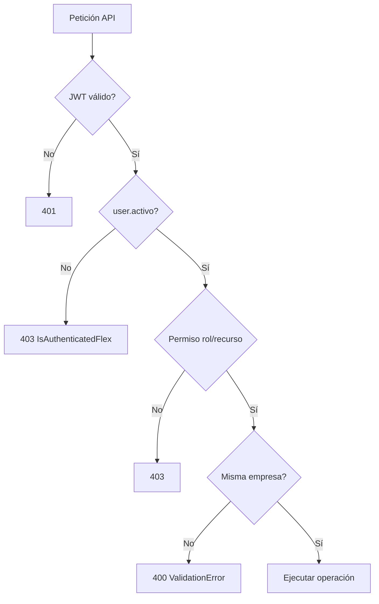

# Capítulo 13 — Seguridad

[← Índice](./README.md) | [← Anterior](./12-casos-uso.md) | [Siguiente →](./14-pruebas.md)

---

## Autenticación

| Mecanismo | Implementación |
|-----------|----------------|
| Protocolo | JWT (JSON Web Tokens) |
| Librería | `rest_framework_simplejwt` |
| Login | `POST /api/auth/login/` — `FlexTokenObtainPairView` |
| Access token | Duración default 60 min (`JWT_ACCESS_TOKEN_LIFETIME`) |
| Refresh token | 1440 min; rotación habilitada |
| Blacklist | Tokens invalidados en logout (`token_blacklist`) |
| Almacenamiento cliente | Cookies `flexop_access`, `flexop_refresh` (`js-cookie`, sameSite strict) |
| Renovación | Interceptor Axios en 401 → `POST /auth/refresh/` |
| Usuario inactivo | Login rechazado en `FlexTokenObtainPairView` |
| Throttle login | 10 intentos/minuto (`LoginRateThrottle`) |

## Autorización (backend)

| Clase | Regla |
|-------|-------|
| `IsAuthenticatedFlex` | Autenticado + `user.activo` |
| `IsAdminUser` | Rol ADMIN |
| `IsSupervisorOrAbove` | SUPERVISOR, GERENTE o ADMIN |
| `IsGerenteOrAbove` | GERENTE o ADMIN |
| `IsOperario` | Rol OPERARIO |
| `IsSupervisorOrAboveForWrite` | Lectura: autenticado; escritura: supervisor+ |
| `CanTransitionAsignacion` | Operario solo sus asignaciones en transiciones; supervisor+ todo |

### Permisos por recurso (resumen)

| Recurso | Lectura | Escritura / acciones |
|---------|---------|----------------------|
| Usuarios | Autenticado (filtrado empresa) | Crear/eliminar: ADMIN |
| Empresas | Autenticado | ADMIN |
| Máquinas, turnos, habilidades | Autenticado | Supervisor+ |
| Asignaciones | Autenticado | Crear/editar: Supervisor+; transiciones: operario propio o supervisor+ |
| Incidencias | Autenticado | Crear: autenticado; resolver: Supervisor+ |
| Producción | Autenticado | Crear: autenticado; editar/eliminar: Supervisor+ |
| Métricas | Autenticado | Solo lectura (GET) |
| Alertas | Autenticado | Resolver: Supervisor+ |
| Notificaciones | Solo propias | Marcar leída: propietario |
| Sugerencias | Autenticado | Aceptar/rechazar: autenticado |
| Reportes generados | Autenticado | Descargar: Gerente+ |
| Exportar CSV | — | Gerente+ |
| Dashboard operario | Operario | — |
| Dashboard supervisor | Supervisor+ | — |
| Dashboard gerente | Gerente+ | — |
| Cola despacho | Gerente+ | Despachar: Gerente+ |

## Autorización (frontend)

| Mecanismo | Archivo | Comportamiento |
|-----------|---------|----------------|
| Guarda de layout | `(dashboard)/layout.tsx` | `loadUser()` → redirect `/login` |
| Control por ruta | `canAccessPath()` | Prefijos por rol en `routes.ts` |
| ADMIN | Rutas extra | Puede acceder `/admin`, `/gerente`, `/supervisor`, `/operario` |

> **Limitación documentada:** La protección de páginas es **client-side**. La seguridad real reside en la API (permisos DRF).

## Roles

| Rol | Código | Propiedades modelo |
|-----|--------|-------------------|
| Operario | `OPERARIO` | `user.es_operario` |
| Supervisor | `SUPERVISOR` | `user.es_supervisor` |
| Gerente | `GERENTE` | `user.es_gerente` |
| Administrador | `ADMIN` | `user.es_admin` |

## Multitenancy (protección de datos)

| Control | Implementación |
|---------|----------------|
| Filtro lectura | `EmpresaFilterMixin.get_queryset()` |
| Asignación en creación | `EmpresaPerformCreateMixin.perform_create()` |
| Bloqueo cambio empresa | `perform_update` elimina `empresa` del payload |
| Validación FK cross-tenant | `validate_same_empresa()` en serializers |
| Tests | `test_multitenancy.py`, `test_security_writes.py` |

## Protección de datos y producción

| Control | Estado |
|---------|--------|
| `SECRET_KEY` obligatorio si DEBUG=False | ✅ |
| `ALLOWED_HOSTS` sin wildcard en prod | ✅ |
| CORS restringido en prod | ✅ (env) |
| Swagger deshabilitado en prod | ✅ |
| Media no expuesto sin `SERVE_MEDIA` | ✅ |
| CSRF middleware | ✅ (relevante para admin Django) |
| Contraseñas hasheadas | ✅ AbstractUser |
| Validadores contraseña Django | ✅ 4 validadores built-in |
| `django-password-validators` extra | ❌ No configurado |
| Cookies httpOnly | ❌ No (accesibles por JS) |
| HTTPS forzado | ❌ No en código (depende despliegue) |
| Rate limit API general | Solo anon 100/día y login |

