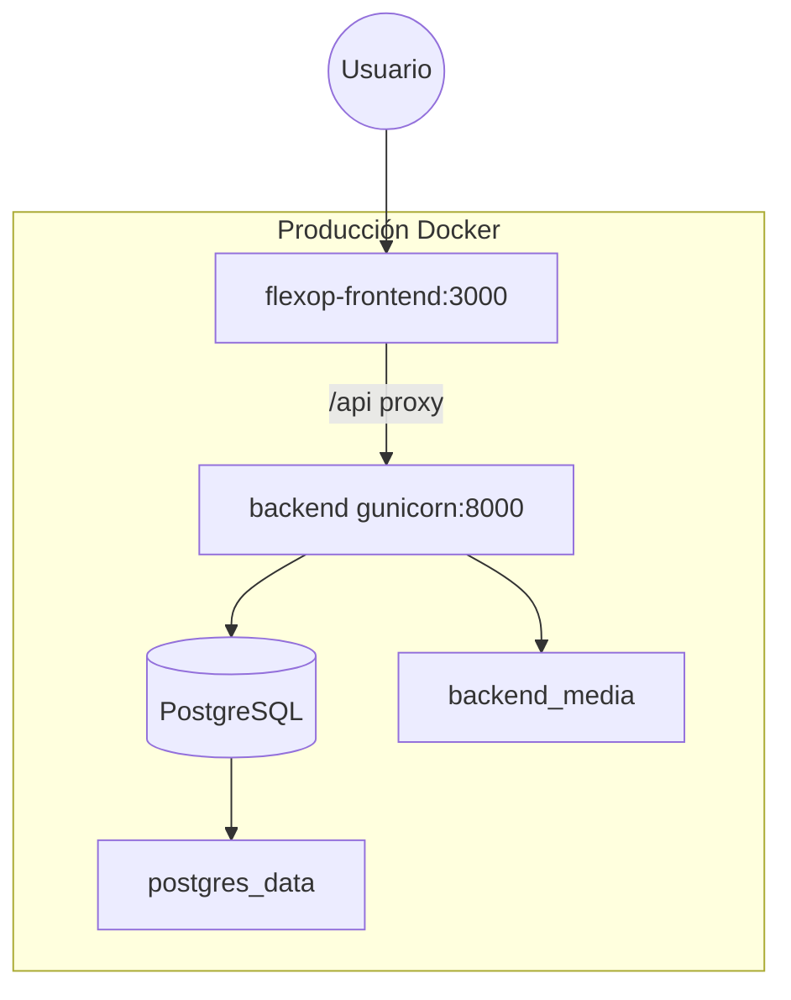

# Capítulo 18 — Manual técnico

[← Índice](./README.md) | [← Anterior](./17-recomendaciones.md) | [Siguiente →](./19-manual-usuario.md)

---

## Requisitos del sistema

| Componente | Versión mínima |
|------------|----------------|
| Python | 3.10+ (CI usa 3.12) |
| Node.js | 20 |
| PostgreSQL | 16 (Docker/CI) o SQLite (dev local) |
| Docker + Compose | Para despliegue containerizado |
| Git | Control de versiones |

## Instalación — Backend (local)

```bash
cd backend
python -m venv .venv
source .venv/bin/activate   # Windows: .venv\Scripts\activate
pip install -r requirements.txt
cp .env.example .env        # opcional: DATABASE_URL, SECRET_KEY
python manage.py migrate
python populate_db.py       # datos demo si DB vacía
python manage.py runserver
```

**URL API:** http://127.0.0.1:8000/api/  
**Swagger (DEBUG=True):** http://127.0.0.1:8000/swagger/

## Instalación — Frontend (local)

```bash
cd flexop-frontend
npm install
# Opcional: .env.local con NEXT_PUBLIC_API_URL=http://127.0.0.1:8000/api
npm run dev
```

**URL:** http://localhost:3000

> Sin proxy: configurar `NEXT_PUBLIC_API_URL` al backend directo. Con Docker: usar `/api` y `BACKEND_INTERNAL_URL`.

## Instalación — Docker (desarrollo)

```bash
# Desde raíz del proyecto
docker compose up --build
```

| Servicio | Puerto |
|----------|--------|
| Frontend | 3000 |
| Backend | 8000 |
| PostgreSQL | interno |

## Configuración

### Variables backend (`backend/.env` o compose)

| Variable | Descripción | Default dev |
|----------|-------------|-------------|
| `DEBUG` | Modo depuración | `True` |
| `SECRET_KEY` | Clave Django | dev key insegura |
| `DATABASE_URL` | Conexión PostgreSQL | SQLite si ausente |
| `ALLOWED_HOSTS` | Hosts permitidos | localhost,127.0.0.1 |
| `CORS_ALLOWED_ORIGINS` | Orígenes CORS prod | localhost:3000 |
| `JWT_ACCESS_TOKEN_LIFETIME` | Minutos access | 60 |
| `JWT_REFRESH_TOKEN_LIFETIME` | Minutos refresh | 1440 |
| `SERVE_MEDIA` | Servir /media/ | False |
| `RUN_POPULATE` | Seed al arrancar Docker | 1 |
| `POPULATE_RESET` | Borrar y re-sembrar | 0 |

### Variables frontend

| Variable | Descripción |
|----------|-------------|
| `NEXT_PUBLIC_API_URL` | URL pública API (prod: `/api`) |
| `BACKEND_INTERNAL_URL` | Proxy Next→Django (ej. `http://backend:8000`) |

## Despliegue producción

```bash
cp .env.example .env
# Editar: SECRET_KEY, POSTGRES_PASSWORD, DATABASE_URL, ALLOWED_HOSTS

docker compose -f docker-compose.prod.yml up --build -d
```

| Cambio vs dev | Detalle |
|---------------|---------|
| Backend | gunicorn 3 workers (`Dockerfile.prod`) |
| Frontend | `next build` + `next start` |
| DEBUG | False |
| RUN_POPULATE | 0 por defecto |
| SERVE_MEDIA | 1 en compose prod |

**Entrypoint backend ejecuta:** `migrate` → `collectstatic` → populate condicional → comando final.

## Dependencias

Ver [Capítulo 9 — Tecnologías](./09-tecnologias.md).

## Ejecución de pruebas

```bash
# Backend
cd backend && pytest -q

# Frontend unitarios
cd flexop-frontend && npm test -- --run

# Cobertura frontend
npm run test:coverage

# E2E (levanta servidores automáticamente)
npm run test:e2e
```

## Estructura de despliegue



## Solución de problemas

| Problema | Causa probable | Acción |
|----------|----------------|--------|
| `ModuleNotFoundError: whitenoise` | Venv incompleto | `pip install -r requirements.txt` |
| 401 en todas las peticiones | Token expirado | Re-login |
| CORS en prod | Origen no listado | Ajustar `CORS_ALLOWED_ORIGINS` |
| Media 404 en prod | SERVE_MEDIA=False | Activar o usar nginx |
| populate no carga datos | DB ya tiene asignaciones | `POPULATE_RESET=1` |
