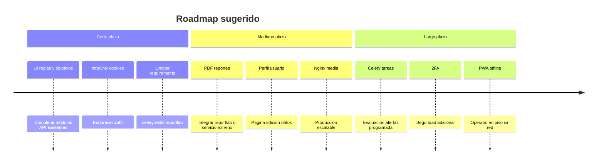

# Anexo — Deuda técnica, incompletos y mejoras futuras

[← Índice](./README.md)

---

## Funcionalidades incompletas (solo código como evidencia)

| ID | Elemento | Estado | Evidencia |
|----|----------|--------|-----------|
| I01 | UI gestión empresas | No implementada | `empresasApi` sin página |
| I02 | UI reglas de alerta | No implementada | `reglasList` en API index sin uso en páginas |
| I03 | UI objetivos producción | No implementada | `objetivosList` sin página |
| I04 | UI productos | No implementada | `/productos/` en maquinasApi |
| I05 | Crear operario desde admin | No implementada | `/admin/operarios` solo toggle activo |
| I06 | Crear turno desde UI | No implementada | `turnoCreate` sin uso |
| I07 | Menú Perfil | Sin funcionalidad | TopBar dropdown |
| I08 | Endpoint `por_turno` métricas | Documentado, no codificado | ViewSet docstring |
| I09 | Reportes PDF reales | Modelo sí; generación no | reportlab sin imports |
| I10 | Archivos en reportes seed | Vacíos | populate sin FileField |
| I11 | Dashboard operario objetivo | Hardcoded 1000 | `DashboardOperarioView` |
| I12 | Django forms/templates | No existen | 0 archivos forms.py/html |

## Deuda técnica

| ID | Deuda | Impacto | Ubicación |
|----|-------|---------|-----------|
| D01 | Tokens JWT en cookies no httpOnly | XSS podría robar sesión | `client.ts`, `authStore` |
| D02 | Auth frontend solo cliente | URL directa bypass visual | `layout.tsx` |
| D03 | Dependencias sin usar en requirements | Confusión, superficie instalación | celery, redis, reportlab |
| D04 | `STATICFILES_STORAGE` deprecado | Fallo futuro Django 5.1+ | settings.py |
| D05 | `tests.py` vacíos en apps | Estructura inconsistente | 8 apps |
| D06 | `django-password-validators` sin configurar | Requisito no aplicado | requirements vs settings |
| D07 | Badge pendientes sugerencias parcial | UX engañosa | sugerencias/page.tsx |
| D08 | Tipos legacy en dashboards | Mantenimiento | `types/index.ts` aliases |
| D09 | MetricasChart evita Recharts | Inconsistencia UI | comentario en MetricasChart.tsx |
| D10 | Sin auditoría de cambios en modelos | Trazabilidad limitada | no django-simple-history |

## Mejoras futuras sugeridas (basadas en gaps del código)

| Mejora | Beneficio esperado |
|--------|-------------------|
| Panel configuración empresa | Admin sin usar API directa |
| WebSockets para alertas | Reemplazar polling 30s |
| Historial auditoría | Cumplimiento normativo |
| Internacionalización i18n | Más allá de es-es hardcoded |
| App móvil operario | Escaneo QR máquinas |
| Integración ERP | Órdenes desde sistema externo |

## Elementos que NO deben documentarse como implementados

- Formularios Django (`forms.py`) — **no existen**
- Templates HTML Django — **no existen**
- Tareas Celery — **no existen**
- Cache Redis — **no existe**
- Recuperación contraseña por email — **no existe**
- Registro público de usuarios — **no existe**
- Kubernetes / Terraform — **no existen en repo**
