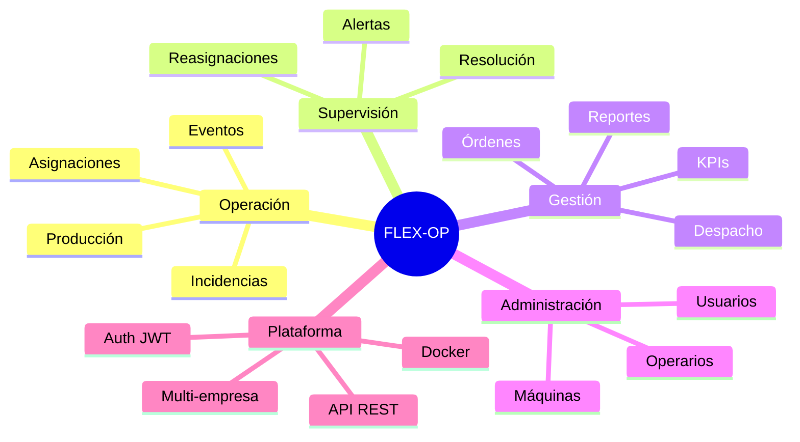
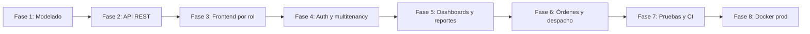
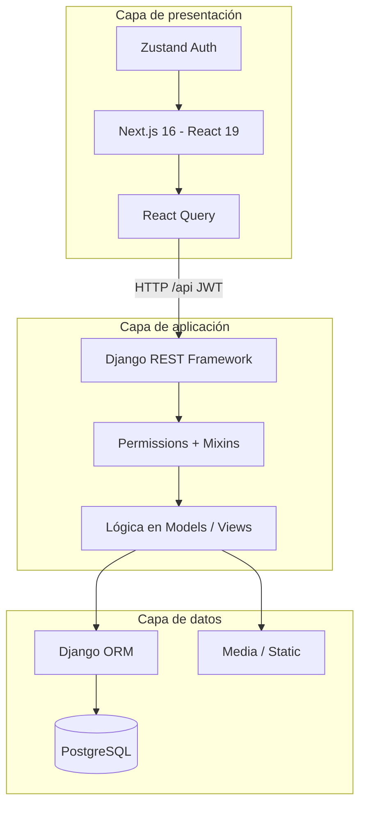
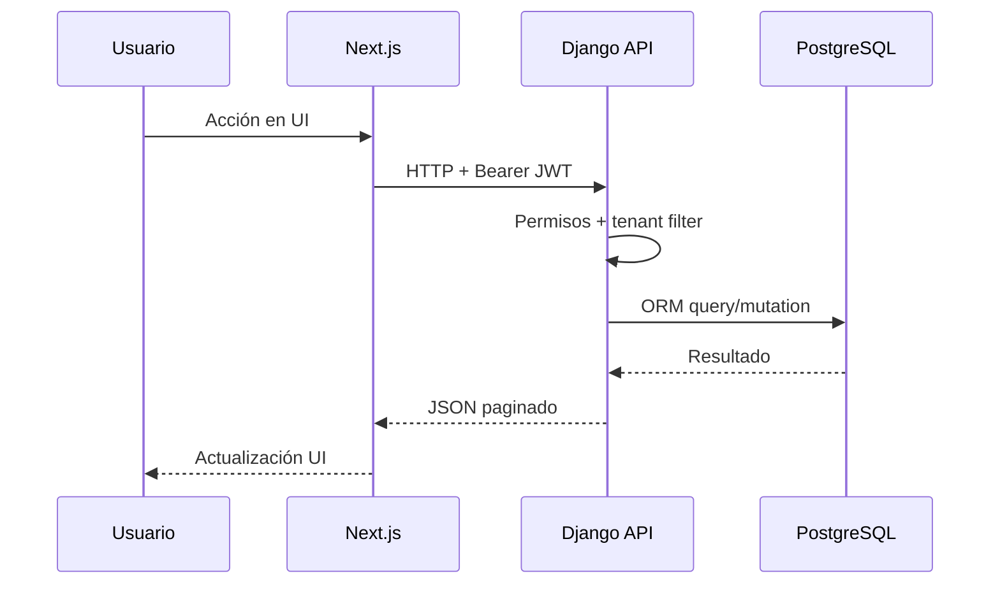
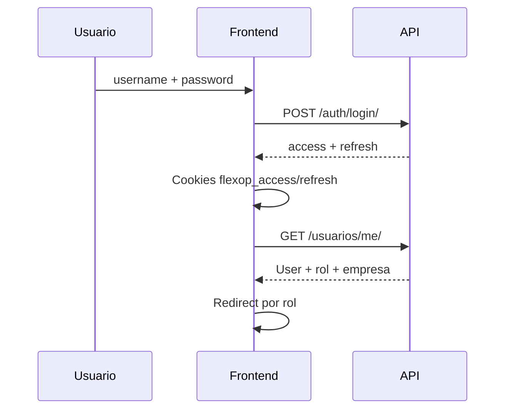
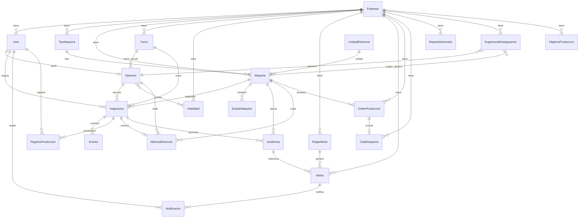
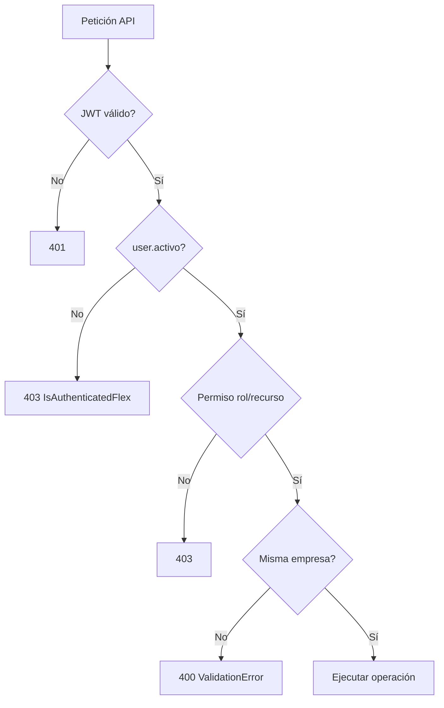
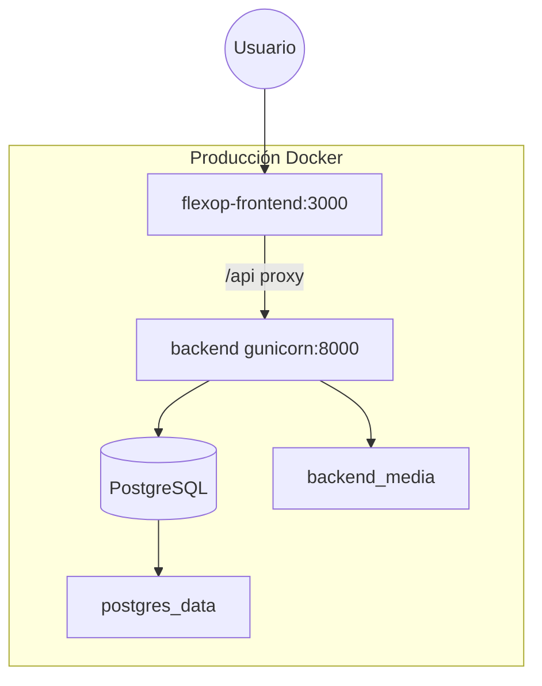
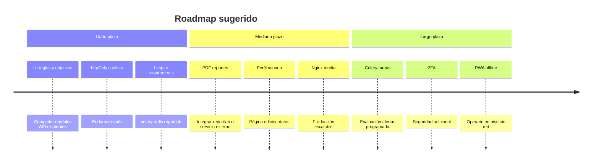

# Capítulo 1 — Resumen ejecutivo

[← Índice](./README.md) | [Siguiente →](./02-introduccion.md)

---

## Descripción general del sistema

**FLEX-OP** (Flexible Operations Platform) es una aplicación web para la gestión operativa de planta de producción. Consta de:

- **Backend:** API REST en Django 4.2 con 8 aplicaciones de dominio (`usuarios`, `maquinas`, `operaciones`, `metricas`, `alertas`, `reasignaciones`, `reportes`, `ordenes`).
- **Frontend:** SPA en Next.js 16 con interfaces diferenciadas por rol.
- **Persistencia:** PostgreSQL en Docker/CI; SQLite como fallback local sin `DATABASE_URL`.
- **Despliegue:** Docker Compose (desarrollo y producción), CI en GitHub Actions.

El sistema implementa un modelo **multi-empresa (multi-tenant)**: cada usuario pertenece a una `Empresa` y los datos operativos se filtran por tenant.

## Problema que resuelve (evidenciado por el dominio implementado)

Según las entidades y flujos presentes en el código, el sistema aborda:

| Problema operativo | Evidencia en código |
|--------------------|---------------------|
| Coordinar operarios y máquinas | Modelo `Asignacion`, estados PENDIENTE→ACTIVA→COMPLETADA |
| Registrar producción en piso | `RegistroProduccion`, página `/operario/produccion` |
| Gestionar incidencias | `Incidencia` con prioridad, escalamiento y resolución |
| Detectar desviaciones automáticamente | `ReglaAlerta.evaluar()`, `Alerta`, `Notificacion` |
| Optimizar asignaciones | `SugerenciaReasignacion.generar_sugerencias()` |
| Medir eficiencia | `MetricaEficiencia.calcular_para_asignacion()`, dashboards gerente |
| Planificar y despachar órdenes | `OrdenProduccion`, `ColaDespacho` |
| Administrar usuarios y catálogos | CRUD en módulo admin del frontend + ViewSets |

> **Nota:** No existe en el repositorio un documento formal de diagnóstico organizacional. La tabla anterior se infiere **únicamente** del dominio modelado e implementado.

## Usuarios objetivo (definidos en código)

Rol definido en `usuarios.models.User.RolChoices` y usado en permisos y rutas del frontend:

| Rol | Código | Interfaz principal |
|-----|--------|-------------------|
| Operario | `OPERARIO` | `/operario/*` |
| Supervisor | `SUPERVISOR` | `/supervisor/*` |
| Gerente | `GERENTE` | `/gerente/*` |
| Administrador | `ADMIN` | `/admin/*` (+ acceso a rutas de otros roles) |

## Beneficios (derivados de funcionalidades implementadas)

| Beneficio | Soporte en el sistema |
|-----------|----------------------|
| Trazabilidad de producción | Registros con asignación, usuario y timestamp |
| Visibilidad en tiempo casi real | Polling 30–60 s en dashboards y alertas |
| Decisiones basadas en datos | Dashboards gerente, métricas, exportación CSV |
| Respuesta a incidentes | Alertas, incidencias, notificaciones |
| Seguridad por roles | Permisos DRF + guardas de ruta en frontend |
| Aislamiento por empresa | `EmpresaFilterMixin`, validación de tenant |
| Despliegue reproducible | Docker, migraciones, seed idempotente |
# Capítulo 2 — Introducción

[← Índice](./README.md) | [← Anterior](./01-resumen-ejecutivo.md) | [Siguiente →](./03-planteamiento-problema.md)

---

## Presentación del proyecto

FLEX-OP es un **sistema de información web** orientado a la operación de planta industrial. El nombre del proyecto Django es `flexop` y la aplicación cliente se denomina `flexop-frontend`.

Componentes identificados en el repositorio:

| Componente | Ruta | Descripción |
|------------|------|-------------|
| API REST | `backend/` | Lógica de negocio, persistencia, autenticación JWT |
| Cliente web | `flexop-frontend/` | Interfaz por rol, consumo de API vía Axios |
| Orquestación | `docker-compose.yml`, `docker-compose.prod.yml` | Servicios db, backend, frontend |
| CI | `.github/workflows/backend-tests.yml` | Tests backend, frontend y E2E |
| Datos demo | `backend/populate_db.py` | Empresa ACME y usuarios de prueba |

## Justificación

> **⚠️ No existe en el repositorio** un documento de justificación académica u organizacional (acta, carta de la empresa, etc.).

**Lo que sí evidencia el código:**

1. **Complejidad operativa modelada:** 22 modelos de dominio, 18 ViewSets/APIViews, más de 40 acciones custom en la API.
2. **Separación de responsabilidades por rol:** cuatro perfiles con permisos distintos en backend (`usuarios/permissions.py`) y frontend (`lib/auth/routes.ts`).
3. **Necesidad de integración:** frontend desacoplado del backend vía REST + JWT, patrón habitual en arquitecturas modernas.
4. **Calidad verificable:** ~139 tests pytest, suite Vitest con MSW, E2E Playwright en CI.

## Importancia para la organización

> **⚠️ No hay datos de una organización real** en el código. La empresa demo es ficticia: **ACME Industries** (RUC `20123456789` en `populate_db.py`).

**Capacidades que una organización obtendría al desplegar el sistema** (según funcionalidades implementadas):

- Centralizar asignaciones operario–máquina–turno.
- Automatizar alertas por reglas configurables.
- Consolidar KPIs gerenciales sin hojas de cálculo manuales.
- Auditar eventos de asignación (`Evento`) e historial de estados de máquina (`EstadoMaquina`).
# Capítulo 3 — Planteamiento del problema

[← Índice](./README.md) | [← Anterior](./02-introduccion.md) | [Siguiente →](./04-objetivos.md)

---

> **Aviso:** No existe un documento de levantamiento de requerimientos con entrevistas o visitas en el repositorio. Este capítulo describe la **situación operativa que el software fue diseñado para atender**, inferida del dominio implementado.

## Situación actual (sin sistema — contraste con lo implementado)

| Aspecto | Situación problemática típica | Lo que el código resuelve |
|---------|------------------------------|---------------------------|
| Asignaciones | Registro manual, sin control de exclusividad | `Asignacion.clean()` valida una máquina/operario activo; `iniciar()`/`finalizar()` transaccionales |
| Producción | Sin consolidación por turno | `RegistroProduccion` ligado a `Asignacion` |
| Incidencias | Sin seguimiento de estado | Estados ABIERTA → EN_PROCESO → RESUELTA / ESCALADA |
| Eficiencia | Cálculo manual | `MetricaEficiencia.calcular_para_asignacion()` con descuento de pausas |
| Alertas | Reactivas | `ReglaAlerta` con 4 tipos evaluables automáticamente |
| Órdenes | Sin cola de despacho | `ColaDespacho` con orden por prioridad (`ordenes/ordering.py`) |
| Reportes | Sin historial | `ReporteGenerado` + exportación CSV |
| Usuarios | Sin control por rol | JWT + 6 clases de permiso DRF |

## Problemas identificados (evidenciados por reglas de negocio en código)

| ID | Problema | Evidencia técnica |
|----|----------|-------------------|
| P01 | Doble uso de máquina u operario en tareas activas | Validación en `Asignacion.clean()` y `iniciar()` |
| P02 | Pérdida de trazabilidad de pausas | Modelo `Evento` con tipos PAUSA/REANUDACION; `metricas/efficiency.py` |
| P03 | Incidencias sin escalamiento | `Incidencia.escalar()` notifica a usuarios GERENTE |
| P04 | Datos mezclados entre empresas | `EmpresaFilterMixin`, `validate_same_empresa()` |
| P05 | Acceso no autorizado por rol | `permissions.py`, `canAccessPath()` en frontend |
| P06 | Cola de despacho desordenada | Pesos de prioridad URGENTE→BAJA unificados |
| P07 | Alertas duplicadas | `_crear_alerta_activa()` con `get_or_create` transaccional |
| P08 | Consultas lentas en listados | Módulos `querysets.py` en operaciones, metricas, alertas |

## Necesidades que cubre el sistema


# Capítulo 4 — Objetivos

[← Índice](./README.md) | [← Anterior](./03-planteamiento-problema.md) | [Siguiente →](./05-alcance.md)

---

> **Aviso:** No existe un archivo de objetivos del proyecto de grado en el repositorio. Los objetivos siguientes se **formulan a partir de las capacidades implementadas y verificadas** en código y pruebas.

## Objetivo general

Desarrollar e implementar una **plataforma web multi-rol y multi-empresa** que permita gestionar la operación de planta de producción —asignaciones, producción, incidencias, alertas, métricas, órdenes y reportes— mediante una API REST segura y una interfaz web moderna, desplegable con contenedores Docker.

*Evidencia de cumplimiento:* 8 apps Django, 17 rutas de frontend, docker-compose dev/prod, CI con 3 jobs de prueba.

## Objetivos específicos

| ID | Objetivo específico | Evidencia en el proyecto |
|----|---------------------|--------------------------|
| OE1 | Modelar el dominio operativo de planta | 22 modelos en 8 apps; 15 archivos de migración |
| OE2 | Exponer operaciones vía API REST documentable | ViewSets + Swagger (solo DEBUG); `ENDPOINTS.md` por app |
| OE3 | Autenticar usuarios con JWT y roles | `FlexTokenObtainPairView`, `User.RolChoices`, blacklist |
| OE4 | Aislar datos por empresa (tenant) | `EmpresaFilterMixin`, tests `test_multitenancy.py` |
| OE5 | Proveer interfaz por rol (operario, supervisor, gerente, admin) | 4 secciones en `src/app/(dashboard)/` |
| OE6 | Calcular eficiencia descontando pausas | `metricas/efficiency.py`, `MetricaEficiencia` |
| OE7 | Automatizar alertas por reglas | `ReglaAlerta.evaluar()`, 4 tipos de regla |
| OE8 | Sugerir reasignaciones inteligentes | `SugerenciaReasignacion.generar_sugerencias()` |
| OE9 | Gestionar órdenes y cola de despacho | `OrdenProduccion`, `ColaDespacho`, tests despacho |
| OE10 | Exportar y descargar reportes de forma segura | `ExportarCSVView`, `descargar` con `IsGerenteOrAbove` |
| OE11 | Garantizar calidad con pruebas automatizadas | pytest (~139), Vitest, Playwright E2E en CI |
| OE12 | Facilitar despliegue reproducible | Dockerfiles, entrypoint, `README-DOCKER.md` |
# Capítulo 5 — Alcance del proyecto

[← Índice](./README.md) | [← Anterior](./04-objetivos.md) | [Siguiente →](./06-metodologia.md)

---

## Alcance funcional (implementado en código)

| Módulo | Incluido | No incluido / parcial |
|--------|----------|------------------------|
| Autenticación JWT | Login, refresh, logout, verify, me | Registro público de usuarios |
| Usuarios y empresas | CRUD usuarios (admin), CRUD empresas (admin) | UI de empresas en frontend |
| Máquinas | CRUD tipos, unidades, máquinas; cambio de estado | UI productos (`/productos/` en API sin página) |
| Operaciones | Turnos, habilidades, operarios, asignaciones, eventos, incidencias | Crear operario/turno desde frontend admin |
| Producción y métricas | Registro, cálculo eficiencia, objetivos (API) | UI objetivos de producción |
| Alertas | Reglas, alertas, notificaciones | UI reglas de alerta |
| Reasignaciones | Generar, listar, aceptar, rechazar sugerencias | — |
| Reportes | Dashboards 3 roles, CSV, historial, descarga | PDF/Excel real (modelo tiene formato PDF; export usa CSV) |
| Órdenes | CRUD órdenes, cola despacho, despachar | — |
| Admin Django | `/admin/` | No documentado como módulo usuario final |

## Alcance técnico

| Elemento | Estado |
|--------|--------|
| API REST JSON | ✅ Implementada |
| Frontend SPA (Next.js) | ✅ Implementado |
| Base de datos relacional | ✅ PostgreSQL / SQLite |
| Autenticación stateless JWT | ✅ |
| Multi-tenant por empresa | ✅ |
| Paginación API (20 ítems) | ✅ |
| Paginación UI (`PaginationBar`) | ✅ En listados principales |
| Docker desarrollo | ✅ |
| Docker producción (gunicorn + next start) | ✅ |
| CI GitHub Actions | ✅ |
| WhiteNoise estáticos | ✅ |
| Celery / Redis tareas async | ❌ En `requirements.txt` pero **sin uso en código** |
| Reportes PDF (reportlab) | ❌ Dependencia sin imports |
| Django templates HTML | ❌ **No existen** (`forms.py` tampoco) |
| Django forms | ❌ **No existen** |
| Autenticación server-side Next.js middleware | ❌ Middleware solo proxy `/api/*` |
| httpOnly cookies | ❌ Tokens en cookies accesibles por JS |

## Limitaciones

| Limitación | Detalle |
|------------|---------|
| Empresa demo única en seed | `populate_db.py` crea una empresa ACME |
| Dashboard operario objetivo fijo | `DashboardOperarioView` usa `objetivo_dia = 1000` hardcodeado |
| Endpoint `por_turno` documentado pero ausente | Docstring en `MetricaEficienciaViewSet` sin `@action` |
| Reportes generados sin archivo en seed | `descargar` retorna 404 si `archivo` vacío |
| Protección de rutas frontend solo cliente | Usuario autenticado puede intentar URLs directas (API sí valida permisos) |
| Menú Perfil sin funcionalidad | `TopBar` ítem "Perfil" sin handler |
| Badge pendientes sugerencias | Cuenta solo página actual del listado |
| `django-password-validators` | En requirements, no configurado en settings |
| Swagger solo en DEBUG | Producción no expone documentación interactiva |
# Capítulo 6 — Metodología

[← Índice](./README.md) | [← Anterior](./05-alcance.md) | [Siguiente →](./07-requerimientos.md)

---

> **Aviso:** No existe en el repositorio un documento que declare formalmente Scrum, XP, Cascada u otra metodología ADSO. Este capítulo describe el **enfoque de desarrollo inferido** de la estructura del código, pruebas e infraestructura.

## Metodología identificada (inferida)

| Práctica | Evidencia en el repositorio |
|----------|----------------------------|
| **Desarrollo incremental por módulos** | 8 apps Django independientes con `urls.py`, `models.py`, `views.py` propios |
| **API First / separación frontend-backend** | Backend solo REST; frontend Next.js sin templates Django |
| **Integración continua** | `.github/workflows/backend-tests.yml` en push/PR |
| **Pruebas automatizadas en capas** | Unitarias (pytest, Vitest), integración (MSW), E2E (Playwright) |
| **Infraestructura como código** | `docker-compose.yml`, Dockerfiles, entrypoint |
| **Seed de datos para demos** | `populate_db.py` idempotente |
| **Refactorización por auditoría** | Módulos `querysets.py`, `ordering.py`, `efficiency.py` (optimización documentada en tests) |

No se evidencia uso de tableros Kanban, sprints documentados ni actas en el repositorio.

## Fases ejecutadas (reconstruidas desde artefactos)



| Fase | Entregables detectados |
|------|------------------------|
| 1 — Modelado | Migraciones `0001_initial` en todas las apps; modelos con métodos de negocio |
| 2 — API | ViewSets, serializers, `ENDPOINTS.md` por módulo |
| 3 — Frontend | 17 páginas en `src/app/`, componentes shadcn |
| 4 — Seguridad | JWT, permissions, `test_multitenancy.py`, `test_security_writes.py` |
| 5 — Analítica | `reportes/views.py` dashboards, Recharts en gerente |
| 6 — Producción planificada | App `ordenes`, cola despacho, tests ordering/despacho |
| 7 — Calidad | 31 archivos pytest, 22+ tests Vitest, 2 specs Playwright |
| 8 — Despliegue | `Dockerfile.prod`, WhiteNoise, `collectstatic` en entrypoint |

## Herramientas de gestión de calidad

| Herramienta | Uso |
|-------------|-----|
| pytest + pytest-cov | Backend; umbral CI ≥30% |
| Vitest + coverage-v8 | Frontend; umbral 70% statements/lines |
| Playwright | E2E login, navegación, logout |
| flake8 / black | En requirements (herramientas CLI, sin config en repo) |
# Capítulo 7 — Análisis de requerimientos

[← Índice](./README.md) | [← Anterior](./06-metodologia.md) | [Siguiente →](./08-arquitectura.md)

---

> Requerimientos **extraídos de funcionalidades implementadas** en backend (`views.py`, `models.py`) y frontend (`src/app/`). No hay documento SRS previo en el repositorio.

## Requerimientos funcionales

### Autenticación y usuarios

| ID | Requerimiento | Evidencia |
|----|---------------|-----------|
| RF001 | El sistema debe permitir autenticación con usuario y contraseña devolviendo JWT | `POST /api/auth/login/` |
| RF002 | El sistema debe renovar tokens de acceso con refresh token | `POST /api/auth/refresh/` |
| RF003 | El sistema debe invalidar refresh token al cerrar sesión | `POST /api/auth/logout/` (blacklist) |
| RF004 | El sistema debe rechazar login de usuarios inactivos | `FlexTokenObtainPairView` |
| RF005 | El usuario autenticado debe consultar su perfil | `GET /api/usuarios/me/` |
| RF006 | El admin debe crear, editar y desactivar usuarios | `UserViewSet` + página admin/usuarios |
| RF007 | El admin debe restablecer contraseña de usuarios | `POST .../set_password/` |
| RF008 | El usuario debe cambiar su propia contraseña | `POST .../change_password/` |
| RF009 | El admin debe gestionar empresas | `EmpresaViewSet` (solo API, sin UI) |

### Máquinas

| ID | Requerimiento | Evidencia |
|----|---------------|-----------|
| RF010 | Gestionar tipos de máquina por empresa | `TipoMaquinaViewSet` |
| RF011 | Gestionar unidades de eficiencia por empresa | `UnidadEficienciaViewSet` |
| RF012 | Registrar máquinas con capacidad teórica y estado | `Maquina` model |
| RF013 | Listar máquinas disponibles u operando | acciones `disponibles`, `operando` |
| RF014 | Cambiar estado de máquina con historial | `cambiar_estado()` → `EstadoMaquina` |
| RF015 | Admin debe crear/editar/desactivar máquinas desde UI | `/admin/maquinas` |

### Operaciones

| ID | Requerimiento | Evidencia |
|----|---------------|-----------|
| RF016 | Gestionar turnos de trabajo | `TurnoViewSet` |
| RF017 | Gestionar habilidades y tipos de máquina asociados | `Habilidad` M2M |
| RF018 | Registrar operarios vinculados a usuario OPERARIO | `Operario` 1:1 User |
| RF019 | Verificar si operario puede operar una máquina | `Operario.puede_operar()` |
| RF020 | Crear asignaciones operario–máquina–turno | `AsignacionViewSet` + UI supervisor |
| RF021 | Iniciar asignación (PENDIENTE→ACTIVA) | `Asignacion.iniciar()` |
| RF022 | Finalizar asignación (ACTIVA→COMPLETADA) | `Asignacion.finalizar()` |
| RF023 | Pausar y reanudar asignación | acciones `pausar`, `reanudar` |
| RF024 | Impedir dos asignaciones activas en misma máquina u operario | `Asignacion.clean()` |
| RF025 | Eliminar solo asignaciones PENDIENTE o CANCELADA | `AsignacionViewSet.destroy()` |
| RF026 | Operario debe iniciar/finalizar su tarea desde dashboard | `/operario` |
| RF027 | Registrar eventos de asignación | `Evento` model |
| RF028 | Reportar incidencias con tipo, prioridad y máquina | `IncidenciaViewSet` + UI operario |
| RF029 | Resolver y escalar incidencias | acciones `resolver`, `escalar` |
| RF030 | Supervisor resuelve incidencias desde UI | `/supervisor/incidencias` |

### Producción y métricas

| ID | Requerimiento | Evidencia |
|----|---------------|-----------|
| RF031 | Registrar producción por asignación | `RegistroProduccionViewSet` |
| RF032 | Operario registra producción desde UI | `/operario/produccion` |
| RF033 | Calcular métrica de eficiencia por asignación | `MetricaEficiencia.calcular_para_asignacion()` |
| RF034 | Consultar métricas por operario, máquina y período | acciones en `MetricaEficienciaViewSet` |
| RF035 | Gestionar objetivos de producción | `ObjetivoProduccionViewSet` (API) |
| RF036 | Consultar cumplimiento de objetivo | `GET .../cumplimiento/` |
| RF037 | Gerente visualiza métricas y gráfico por máquina | `/gerente/metricas` |

### Alertas y notificaciones

| ID | Requerimiento | Evidencia |
|----|---------------|-----------|
| RF038 | Configurar reglas de alerta por empresa | `ReglaAlerta` |
| RF039 | Evaluar reglas automáticamente | `evaluar()`, `evaluar_todas` |
| RF040 | Gestionar alertas activas y resolverlas | `AlertaViewSet` |
| RF041 | Supervisor resuelve alertas individual o en lote | UI alertas + `resolverTodas` |
| RF042 | Notificar usuarios con campana de notificaciones | `Notificacion` + `NotificationBell` |
| RF043 | Marcar notificaciones como leídas | `marcar_leida`, `marcar_todas_leidas` |

### Reasignaciones

| ID | Requerimiento | Evidencia |
|----|---------------|-----------|
| RF044 | Generar sugerencias de reasignación | `POST /sugerencias/generar/` |
| RF045 | Listar sugerencias pendientes | `GET pendientes/` |
| RF046 | Aceptar sugerencia (crea nueva asignación) | `SugerenciaReasignacion.aceptar()` |
| RF047 | Rechazar sugerencia | `SugerenciaReasignacion.rechazar()` |
| RF048 | Supervisor gestiona sugerencias desde UI | `/supervisor/sugerencias` |

### Reportes y dashboards

| ID | Requerimiento | Evidencia |
|----|---------------|-----------|
| RF049 | Dashboard personalizado para operario | `DashboardOperarioView` |
| RF050 | Dashboard para supervisor | `DashboardSupervisorView` |
| RF051 | Dashboard gerencial con KPIs y gráficos | `DashboardGerenteView` + Recharts |
| RF052 | Exportar datos a CSV | `ExportarCSVView` |
| RF053 | Historial de reportes generados | `ReporteGeneradoViewSet` |
| RF054 | Descargar reporte de forma autenticada | `GET .../descargar/` |

### Órdenes de producción

| ID | Requerimiento | Evidencia |
|----|---------------|-----------|
| RF055 | Crear órdenes de producción con prioridad | `OrdenProduccionViewSet` |
| RF056 | Iniciar, registrar producción, completar y cancelar órdenes | acciones en ViewSet |
| RF057 | Generar número de orden automáticamente | `perform_create` en views |
| RF058 | Encolar orden al completar | `OrdenProduccion.completar()` |
| RF059 | Gestionar cola de despacho ordenada por prioridad | `ColaDespacho`, `ordering.py` |
| RF060 | Despachar ítem de cola (solo gerente+) | `ColaDespachoViewSet` + UI gerente |

### Administración operarios

| ID | Requerimiento | Evidencia |
|----|---------------|-----------|
| RF061 | Admin lista operarios con turno y habilidades | `/admin/operarios` |
| RF062 | Admin activa/desactiva operarios | `operarioUpdate` con campo `activo` |

## Requerimientos no funcionales

| ID | Requerimiento | Evidencia |
|----|---------------|-----------|
| RNF001 | Autenticación stateless con JWT | `SIMPLE_JWT` en settings |
| RNF002 | Rotación y blacklist de refresh tokens | `ROTATE_REFRESH_TOKENS`, `BLACKLIST_AFTER_ROTATION` |
| RNF003 | Paginación de listados API (20 ítems) | `PAGE_SIZE = 20` |
| RNF004 | Aislamiento de datos por empresa | `EmpresaFilterMixin`, tests multitenancy |
| RNF005 | Usuario inactivo no puede operar | `IsAuthenticatedFlex` |
| RNF006 | Throttle de login (10/min) | `LoginRateThrottle` |
| RNF007 | Throttle anónimo (100/día) | `DEFAULT_THROTTLE_RATES` |
| RNF008 | CORS configurable por entorno | settings DEBUG vs prod |
| RNF009 | SECRET_KEY obligatorio en producción | `ImproperlyConfigured` si falta |
| RNF010 | ALLOWED_HOSTS explícito en producción | sin wildcard |
| RNF011 | Swagger solo en desarrollo | `_debug_only` en urls |
| RNF012 | Archivos estáticos comprimidos en prod | WhiteNoise CompressedManifest |
| RNF013 | Media condicional en producción | `SERVE_MEDIA` env |
| RNF014 | Idioma español y zona America/Lima | settings i18n |
| RNF015 | Concurrencia segura en asignaciones | `select_for_update` en iniciar/finalizar |
| RNF016 | Operaciones atómicas en métricas | `calcular_para_asignacion` transaccional |
| RNF017 | Optimización N+1 en listados | querysets + `test_api_query_count` |
| RNF018 | Cobertura mínima backend CI 30% | workflow pytest --cov-fail-under=30 |
| RNF019 | Cobertura mínima frontend 70% statements | vitest.config thresholds |
| RNF020 | Tests E2E en pipeline CI | job e2e-test |
| RNF021 | Seed idempotente de base de datos | `test_populate_db.py` |
| RNF022 | Despliegue con migraciones automáticas | docker-entrypoint.sh |
| RNF023 | Interfaz responsive con Tailwind | clases utility en componentes |
| RNF024 | Validación de formularios cliente | Zod + react-hook-form |
| RNF025 | Polling para datos operativos (30–60 s) | useApi refetchInterval |

## Requerimientos NO implementados (explícito)

| ID propuesto | Descripción |
|--------------|-------------|
| — | Registro self-service de usuarios |
| — | Recuperación de contraseña por email |
| — | UI para empresas, reglas de alerta, objetivos |
| — | Generación real de PDF (reportlab sin uso) |
| — | Tareas programadas Celery |
| — | Autenticación de dos factores |
| — | Auditoría de cambios (django-simple-history no presente) |
# Capítulo 8 — Arquitectura del sistema

[← Índice](./README.md) | [← Anterior](./07-requerimientos.md) | [Siguiente →](./09-tecnologias.md)

---

## Arquitectura general

**Patrón:** Cliente-Servidor en **3 capas** con API REST como frontera.



## Componentes principales

| Componente | Tecnología | Responsabilidad |
|------------|------------|-----------------|
| Cliente web | Next.js App Router | UI, routing, proxy API |
| Cliente HTTP | Axios + interceptors | JWT, refresh automático |
| Estado servidor | TanStack React Query | Cache, polling, mutaciones |
| API | Django + DRF | CRUD, acciones, validación |
| Auth | SimpleJWT + blacklist | Tokens access/refresh |
| Persistencia | PostgreSQL / SQLite | Datos transaccionales |
| Archivos | FileField/ImageField | Logos, reportes, perfiles |
| Estáticos prod | WhiteNoise | CSS/JS admin y DRF |
| Contenedores | Docker Compose | Orquestación local/prod |
| CI | GitHub Actions | Verificación automática |

## Flujo de información



### Flujo de autenticación



## Patrones de diseño utilizados

| Patrón | Ubicación | Propósito |
|--------|-----------|-----------|
| **MVC / MVT (Django)** | Models, Views, URLs | Separación backend |
| **Repository-like (Querysets)** | `*/querysets.py` | Optimización de consultas |
| **Mixin** | `EmpresaFilterMixin`, `EmpresaPerformCreateMixin` | Cross-cutting tenant |
| **ViewSet + Router** | Todas las apps | REST uniforme |
| **Custom actions** | `@action` en ViewSets | Operaciones de negocio |
| **SPA + BFF proxy** | `middleware.ts` | Unificar origen `/api` |
| **Observer-like (polling)** | React Query `refetchInterval` | Actualización periódica |
| **State management** | Zustand persist | Sesión de usuario |

**No evidenciado en código:** microservicios, event-driven (Celery sin usar), CQRS, GraphQL.
# Capítulo 9 — Tecnologías utilizadas

[← Índice](./README.md) | [← Anterior](./08-arquitectura.md) | [Siguiente →](./10-modelo-datos.md)

---

## Backend (`backend/requirements.txt`)

| Tecnología | Versión declarada | Propósito | ¿Usado en código? |
|------------|------------------|-----------|-------------------|
| Python | 3.10+ (CI: 3.12) | Lenguaje runtime | ✅ |
| Django | >=4.2, <5.0 | Framework web ORM | ✅ |
| djangorestframework | >=3.14.0 | API REST | ✅ |
| djangorestframework-simplejwt | >=5.3.0 | Autenticación JWT | ✅ |
| psycopg2-binary | >=2.9.9 | Driver PostgreSQL | ✅ (vía engine) |
| dj-database-url | >=2.1.0 | Parse DATABASE_URL | ✅ |
| django-cors-headers | >=4.3.0 | CORS | ✅ |
| python-dotenv | >=1.0.0 | Variables .env | ✅ |
| drf-yasg | >=1.21.7 | Swagger/OpenAPI | ✅ (DEBUG) |
| Pillow | >=10.1.0 | Imágenes ImageField | ✅ (vía Django) |
| gunicorn | >=21.2.0 | Servidor WSGI prod | ✅ (Dockerfile.prod) |
| whitenoise | >=6.6.0 | Archivos estáticos prod | ✅ |
| pytest | >=7.4.3 | Framework de pruebas | ✅ |
| pytest-django | >=4.7.0 | Integración Django | ✅ |
| pytest-cov | >=4.1.0 | Cobertura | ✅ |
| celery | >=5.3.4 | Tareas async | ❌ Sin imports |
| redis | >=5.0.1 | Broker/cache | ❌ Sin imports |
| reportlab | >=4.0.7 | PDF | ❌ Sin imports |
| django-password-validators | >=1.7.1 | Validación contraseñas | ❌ No en settings |
| python-dateutil | >=2.8.2 | Fechas | ❌ Sin imports |
| django-debug-toolbar | >=4.2.0 | Debug UI | ❌ No en INSTALLED_APPS |
| django-extensions | >=3.2.3 | Utilidades Django | ❌ No en INSTALLED_APPS |
| flake8 / black | >=6 / >=23 | Calidad código | CLI only |

## Frontend (`flexop-frontend/package.json`)

| Tecnología | Versión | Propósito |
|------------|---------|-----------|
| Next.js | 16.2.4 | Framework React SSR/SSG |
| React | 19.2.4 | UI library |
| TypeScript | ^5 | Tipado estático |
| TanStack React Query | ^5.100.5 | Estado servidor async |
| Axios | ^1.15.2 | Cliente HTTP |
| Zustand | ^5.0.12 | Estado auth |
| react-hook-form | ^7.74.0 | Formularios |
| Zod | ^4.3.6 | Validación esquemas |
| Tailwind CSS | ^4 | Estilos utility-first |
| shadcn / radix-ui | ^4.5 / ^1.4 | Componentes UI |
| Recharts | ^3.8.1 | Gráficos dashboard gerente |
| js-cookie | ^3.0.5 | Cookies JWT |
| sonner | ^2.0.7 | Notificaciones toast |
| Vitest | ^3.2.4 | Tests unitarios |
| MSW | ^2.7.5 | Mock API en tests |
| Playwright | ^1.52.0 | Tests E2E |
| ESLint | ^9 | Linter |

## Infraestructura

| Tecnología | Versión | Propósito |
|------------|---------|-----------|
| PostgreSQL | 16 (Alpine en Docker) | BD producción/dev |
| Docker / Compose | — | Contenedorización |
| Node.js | 20 (Alpine en Docker) | Runtime frontend |
| GitHub Actions | — | CI/CD |
| SQLite | 3 | BD fallback local |

## Lo que NO está en el stack

| Elemento | Estado |
|----------|--------|
| Django Templates HTML | No existe |
| Django Forms (`forms.py`) | No existe |
| GraphQL | No implementado |
| WebSockets | No implementado |
| Kubernetes | No hay manifests |
| Nginx | No configurado (recomendado en docs para media a escala) |
# Capítulo 10 — Modelo de datos

[← Índice](./README.md) | [← Anterior](./09-tecnologias.md) | [Siguiente →](./11-modulos.md)

---

## Diagrama entidad-relación



## Entidades (22 modelos)

### usuarios

| Modelo | Tabla | Descripción |
|--------|-------|-------------|
| `Empresa` | `empresas` | Tenant: datos legales, logo, estado activo |
| `User` | `usuarios` | Usuario del sistema con rol y FK a empresa |

### maquinas

| Modelo | Tabla | Descripción |
|--------|-------|-------------|
| `TipoMaquina` | `tipos_maquina` | Clasificación de equipos |
| `UnidadEficiencia` | `unidades_eficiencia` | Unidad de medida de capacidad |
| `Maquina` | `maquinas` | Equipo productivo con estado actual |
| `EstadoMaquina` | — | Historial de cambios de estado |

### operaciones

| Modelo | Tabla | Descripción |
|--------|-------|-------------|
| `Turno` | — | Franja horaria de trabajo |
| `Habilidad` | — | Competencia del operario; M2M tipos máquina |
| `Operario` | — | Perfil 1:1 de usuario OPERARIO |
| `Asignacion` | — | Tarea operario–máquina con ciclo de vida |
| `Evento` | — | Log INICIO/FIN/PAUSA/REANUDACION |
| `Incidencia` | — | Problema reportado en planta |

### metricas

| Modelo | Tabla | Descripción |
|--------|-------|-------------|
| `RegistroProduccion` | — | Cantidad producida por asignación |
| `MetricaEficiencia` | — | Eficiencia calculada; única por asignación |
| `ObjetivoProduccion` | — | Meta por máquina, turno u operario |

### alertas

| Modelo | Tabla | Descripción |
|--------|-------|-------------|
| `ReglaAlerta` | — | Condición configurable con umbral |
| `Alerta` | — | Instancia activa/resuelta de una regla |
| `Notificacion` | — | Mensaje al usuario |

### reasignaciones

| Modelo | Tabla | Descripción |
|--------|-------|-------------|
| `SugerenciaReasignacion` | — | Propuesta de mover operario a otra máquina |

### reportes

| Modelo | Tabla | Descripción |
|--------|-------|-------------|
| `ReporteGenerado` | — | Archivo exportado con metadatos JSON |

### ordenes

| Modelo | Tabla | Descripción |
|--------|-------|-------------|
| `OrdenProduccion` | — | Pedido de fabricación con prioridad |
| `ColaDespacho` | — | Cola FIFO ponderada por prioridad |

## Migraciones por aplicación

| App | Archivos de migración |
|-----|----------------------|
| usuarios | `0001_initial`, `0002_fix_bugs` |
| maquinas | `0001_initial`, `0002_initial` |
| operaciones | `0001_initial`, `0002_initial`, `0003_asignacion_evento_incidencia_and_more` |
| ordenes | `0001_initial` |
| metricas | `0001_initial`, `0002_initial`, `0003_unique_metrica_asignacion` |
| alertas | `0001_initial`, `0002_initial`, `0003_fix_bugs` |
| reasignaciones | `0001_initial` |
| reportes | `0001_initial` |

## Enumeraciones principales (choices en código)

| Modelo | Campo | Valores |
|--------|-------|---------|
| User | rol | OPERARIO, SUPERVISOR, GERENTE, ADMIN |
| Asignacion | estado | PENDIENTE, ACTIVA, COMPLETADA, CANCELADA |
| Maquina | estado_actual | DISPONIBLE, OPERANDO, MANTENIMIENTO, PARADA, FUERA_SERVICIO |
| Incidencia | tipo | FALLA_MAQUINA, FALTA_MATERIAL, PROBLEMA_CALIDAD, OTRO |
| Incidencia | prioridad | BAJA, MEDIA, ALTA, CRITICA |
| Incidencia | estado | ABIERTA, EN_PROCESO, RESUELTA, ESCALADA |
| OrdenProduccion | prioridad | BAJA, NORMAL, ALTA, URGENTE |
| OrdenProduccion | estado | PENDIENTE, EN_PROCESO, LISTA, DESPACHADA, CANCELADA |
| SugerenciaReasignacion | estado | PENDIENTE, ACEPTADA, RECHAZADA, EXPIRADA |
# Capítulo 11 — Módulos del sistema

[← Índice](./README.md) | [← Anterior](./10-modelo-datos.md) | [Siguiente →](./12-casos-uso.md)

---

## Módulo 1 — Usuarios y autenticación

| Aspecto | Detalle |
|---------|---------|
| **Nombre** | `usuarios` |
| **Objetivo** | Gestionar identidad, roles, empresas y autenticación JWT |
| **Funcionalidades** | Login/logout/refresh; CRUD usuarios; CRUD empresas; perfil `me`; cambio de contraseña |
| **Usuarios** | Todos (auth); ADMIN (gestión usuarios/empresas) |
| **Archivos clave** | `models.py`, `views.py`, `views_auth.py`, `permissions.py`, `mixins.py` |

## Módulo 2 — Máquinas

| Aspecto | Detalle |
|---------|---------|
| **Nombre** | `maquinas` |
| **Objetivo** | Catálogo de equipos, tipos y unidades de medida |
| **Funcionalidades** | CRUD tipos/unidades/máquinas; listar disponibles/operando; cambiar estado con historial |
| **Usuarios** | SUPERVISOR+ (escritura); ADMIN (UI máquinas) |
| **Archivos clave** | `models.py`, `views.py` |

## Módulo 3 — Operaciones

| Aspecto | Detalle |
|---------|---------|
| **Nombre** | `operaciones` |
| **Objetivo** | Coordinar trabajo diario: turnos, operarios, asignaciones, incidencias |
| **Funcionalidades** | CRUD turnos/habilidades/operarios/asignaciones; iniciar/pausar/finalizar; incidencias resolver/escalar |
| **Usuarios** | OPERARIO (ejecución); SUPERVISOR (coordinación); ADMIN (operarios list) |
| **Archivos clave** | `models.py`, `views.py`, `querysets.py` |

## Módulo 4 — Métricas y producción

| Aspecto | Detalle |
|---------|---------|
| **Nombre** | `metricas` |
| **Objetivo** | Registrar producción y calcular eficiencia |
| **Funcionalidades** | CRUD producción; calcular métricas; objetivos y cumplimiento (API) |
| **Usuarios** | OPERARIO (registro); GERENTE (consulta); SUPERVISOR+ (objetivos API) |
| **Archivos clave** | `models.py`, `efficiency.py`, `views.py`, `querysets.py` |

## Módulo 5 — Alertas y notificaciones

| Aspecto | Detalle |
|---------|---------|
| **Nombre** | `alertas` |
| **Objetivo** | Detectar desviaciones y notificar usuarios |
| **Funcionalidades** | Reglas evaluables; alertas activas; resolver/escalar; notificaciones leídas |
| **Usuarios** | SUPERVISOR (gestión alertas); todos (notificaciones propias) |
| **Archivos clave** | `models.py`, `views.py`, `querysets.py` |

## Módulo 6 — Reasignaciones

| Aspecto | Detalle |
|---------|---------|
| **Nombre** | `reasignaciones` |
| **Objetivo** | Sugerir y aplicar reasignaciones operario–máquina |
| **Funcionalidades** | Generar sugerencias; aceptar (crea asignación); rechazar; historial |
| **Usuarios** | SUPERVISOR |
| **Archivos clave** | `models.py`, `views.py` |

## Módulo 7 — Reportes y dashboards

| Aspecto | Detalle |
|---------|---------|
| **Nombre** | `reportes` |
| **Objetivo** | Consolidar KPIs y exportar información |
| **Funcionalidades** | Dashboard operario/supervisor/gerente; CSV; historial reportes; descarga segura |
| **Usuarios** | OPERARIO, SUPERVISOR, GERENTE (según dashboard) |
| **Archivos clave** | `views.py`, `models.py` |

## Módulo 8 — Órdenes de producción

| Aspecto | Detalle |
|---------|---------|
| **Nombre** | `ordenes` |
| **Objetivo** | Planificar producción y gestionar despacho |
| **Funcionalidades** | CRUD órdenes; ciclo iniciar/completar; cola despacho; reordenar |
| **Usuarios** | GERENTE (órdenes y despacho); SUPERVISOR+ (órdenes API write) |
| **Archivos clave** | `models.py`, `views.py`, `ordering.py` |

## Módulo 9 — Cliente web (frontend)

| Aspecto | Detalle |
|---------|---------|
| **Nombre** | `flexop-frontend` |
| **Objetivo** | Interfaz de usuario por rol consumiendo la API |
| **Funcionalidades** | Login; 17 páginas dashboard; formularios; gráficos; paginación |
| **Usuarios** | OPERARIO, SUPERVISOR, GERENTE, ADMIN |
| **Archivos clave** | `src/app/`, `src/hooks/useApi.ts`, `src/lib/api/` |

## Módulos auxiliares (no funcionales de negocio)

| Módulo | Propósito |
|--------|-----------|
| `backend/tests/` | Multitenancy, seguridad escritura, populate |
| `backend/flexop/` | Settings, URLs raíz, tests seguridad |
| `scripts/e2e-*.sh` | Arranque para Playwright |
| `.github/workflows/` | CI automatizado |
| `backend/reciclables/` | Documentación legacy (no app activa) |
# Capítulo 12 — Casos de uso

[← Índice](./README.md) | [← Anterior](./11-modulos.md) | [Siguiente →](./13-seguridad.md)

---

## Diagrama de casos de uso

```mermaid
flowchart TB
  subgraph actores [Actores]
    OP((Operario))
    SU((Supervisor))
    GE((Gerente))
    AD((Admin))
    SYS((Sistema))
  end
  subgraph operario_uc [Operario]
    UC003[Ver dashboard]
    UC004[Iniciar tarea]
    UC005[Finalizar tarea]
    UC006[Registrar producción]
    UC007[Reportar incidencia]
  end
  subgraph supervisor_uc [Supervisor]
    UC009[Ver dashboard supervisor]
    UC010[Resolver alerta]
    UC012[Aceptar sugerencia]
    UC014[Crear asignación]
    UC016[Resolver incidencia]
  end
  subgraph gerente_uc [Gerente]
    UC017[Ver dashboard gerente]
    UC018[Exportar CSV]
    UC021[Crear orden]
    UC023[Despachar cola]
  end
  subgraph admin_uc [Admin]
    UC024[Gestionar usuarios]
    UC025[Gestionar máquinas]
  end
  OP --> UC003 & UC004 & UC005 & UC006 & UC007
  SU --> UC009 & UC010 & UC012 & UC014 & UC016
  GE --> UC017 & UC018 & UC021 & UC023
  AD --> UC024 & UC025
  SYS --> UC038[Evaluar reglas alerta]
  SYS --> UC044[Generar sugerencias]
```



---

## CU001 — Iniciar sesión

| Campo | Descripción |
|-------|-------------|
| **Actor** | Cualquier usuario registrado y activo |
| **Descripción** | El usuario ingresa credenciales y obtiene tokens JWT para acceder al sistema |
| **Precondiciones** | Usuario existe, `activo=True` |
| **Flujo principal** | 1. Usuario accede a `/login`. 2. Ingresa username y password. 3. Frontend envía `POST /api/auth/login/`. 4. API valida y retorna access + refresh. 5. Se guardan cookies y se consulta `/api/usuarios/me/`. 6. Redirección al dashboard según rol |
| **Postcondiciones** | Sesión autenticada; tokens en cookies |

## CU002 — Cerrar sesión

| Campo | Descripción |
|-------|-------------|
| **Actor** | Usuario autenticado |
| **Descripción** | Invalida refresh token y limpia sesión local |
| **Precondiciones** | Usuario autenticado |
| **Flujo principal** | 1. Usuario pulsa Cerrar sesión en TopBar. 2. `POST /api/auth/logout/` con refresh. 3. Se limpian cookies y store |
| **Postcondiciones** | Usuario en `/login` |

## CU003 — Consultar dashboard operario

| Campo | Descripción |
|-------|-------------|
| **Actor** | Operario |
| **Descripción** | Visualiza KPIs del día y asignación activa/pendiente |
| **Precondiciones** | Rol OPERARIO, autenticado |
| **Flujo principal** | 1. Accede a `/operario`. 2. Frontend consulta `GET /api/dashboard/operario/` (poll 30s). 3. Muestra producción del día, objetivo, asignación |
| **Postcondiciones** | Dashboard actualizado |

## CU004 — Iniciar tarea asignada

| Campo | Descripción |
|-------|-------------|
| **Actor** | Operario (propia asignación) o Supervisor |
| **Descripción** | Cambia asignación de PENDIENTE a ACTIVA |
| **Precondiciones** | Asignación PENDIENTE; operario con habilidad; máquina disponible |
| **Flujo principal** | 1. Usuario pulsa Iniciar. 2. `POST /api/asignaciones/{id}/iniciar/`. 3. Modelo valida exclusividad, actualiza máquina a OPERANDO, crea Evento INICIO |
| **Postcondiciones** | Asignación ACTIVA |

## CU005 — Finalizar tarea

| Campo | Descripción |
|-------|-------------|
| **Actor** | Operario o Supervisor |
| **Descripción** | Completa asignación activa |
| **Precondiciones** | Asignación ACTIVA |
| **Flujo principal** | 1. Pulsa Finalizar. 2. `POST .../finalizar/`. 3. Estado COMPLETADA; libera máquina si no hay otra activa; incrementa contador operario; puede disparar cálculo métrica |
| **Postcondiciones** | Asignación COMPLETADA |

## CU006 — Registrar producción

| Campo | Descripción |
|-------|-------------|
| **Actor** | Operario |
| **Descripción** | Registra cantidad producida en asignación activa |
| **Precondiciones** | Asignación activa del operario |
| **Flujo principal** | 1. En `/operario/produccion` abre diálogo Registrar. 2. Ingresa cantidad y observaciones. 3. `POST /api/produccion/` con `asignacion` activa |
| **Postcondiciones** | Nuevo `RegistroProduccion` |

## CU007 — Reportar incidencia

| Campo | Descripción |
|-------|-------------|
| **Actor** | Operario |
| **Descripción** | Reporta problema en planta |
| **Precondiciones** | Autenticado como OPERARIO |
| **Flujo principal** | 1. En `/operario/incidencias` abre formulario. 2. Selecciona máquina, tipo, prioridad, título, descripción. 3. `POST /api/incidencias/` |
| **Postcondiciones** | Incidencia ABIERTA creada |

## CU008 — Consultar incidencias propias

| Campo | Descripción |
|-------|-------------|
| **Actor** | Operario |
| **Descripción** | Lista incidencias reportadas (paginado) |
| **Precondiciones** | Autenticado |
| **Flujo principal** | 1. Accede a incidencias. 2. `GET /api/incidencias/?page=N` |
| **Postcondiciones** | Listado mostrado |

## CU009 — Consultar dashboard supervisor

| Campo | Descripción |
|-------|-------------|
| **Actor** | Supervisor |
| **Descripción** | KPIs operativos, alertas y sugerencias resumidas |
| **Precondiciones** | Rol SUPERVISOR |
| **Flujo principal** | 1. `/supervisor`. 2. `GET /api/dashboard/supervisor/` + alertas activas + sugerencias pendientes |
| **Postcondiciones** | Vista consolidada |

## CU010 — Resolver alerta

| Campo | Descripción |
|-------|-------------|
| **Actor** | Supervisor |
| **Descripción** | Marca alerta como resuelta |
| **Precondiciones** | Alerta ACTIVA |
| **Flujo principal** | 1. En alertas pulsa Resolver. 2. `POST /api/alertas/{id}/resolver/` |
| **Postcondiciones** | Alerta RESUELTA |

## CU011 — Resolver todas las alertas activas

| Campo | Descripción |
|-------|-------------|
| **Actor** | Supervisor |
| **Descripción** | Resolución en lote |
| **Precondiciones** | Hay alertas ACTIVA |
| **Flujo principal** | 1. Pulsa Resolver todas. 2. Frontend ejecuta `Promise.allSettled` sobre cada alerta activa |
| **Postcondiciones** | Alertas resueltas; cache invalidado |

## CU012 — Aceptar sugerencia de reasignación

| Campo | Descripción |
|-------|-------------|
| **Actor** | Supervisor |
| **Descripción** | Aplica reasignación propuesta por el sistema |
| **Precondiciones** | Sugerencia PENDIENTE |
| **Flujo principal** | 1. En sugerencias pulsa Aceptar. 2. `POST /api/sugerencias/{id}/aceptar/`. 3. Modelo crea nueva Asignacion |
| **Postcondiciones** | Sugerencia ACEPTADA; nueva asignación |

## CU013 — Rechazar sugerencia

| Campo | Descripción |
|-------|-------------|
| **Actor** | Supervisor |
| **Descripción** | Descarta sugerencia |
| **Precondiciones** | Sugerencia PENDIENTE |
| **Flujo principal** | 1. Pulsa Rechazar. 2. `POST .../rechazar/` |
| **Postcondiciones** | Sugerencia RECHAZADA |

## CU014 — Crear asignación

| Campo | Descripción |
|-------|-------------|
| **Actor** | Supervisor |
| **Descripción** | Asigna operario a máquina y turno |
| **Precondiciones** | Rol SUPERVISOR+ |
| **Flujo principal** | 1. En asignaciones abre diálogo. 2. Selecciona operario, máquina, turno, fecha. 3. `POST /api/asignaciones/` |
| **Postcondiciones** | Asignación PENDIENTE |

## CU015 — Gestionar ciclo de asignación (supervisor)

| Campo | Descripción |
|-------|-------------|
| **Actor** | Supervisor |
| **Descripción** | Iniciar o finalizar asignaciones desde listado |
| **Precondiciones** | Asignación en estado válido |
| **Flujo principal** | Igual CU004/CU005 desde `/supervisor/asignaciones` |
| **Postcondiciones** | Estado actualizado |

## CU016 — Resolver incidencia

| Campo | Descripción |
|-------|-------------|
| **Actor** | Supervisor |
| **Descripción** | Cierra incidencia con solución |
| **Precondiciones** | Incidencia no RESUELTA |
| **Flujo principal** | 1. Abre diálogo en incidencias supervisor. 2. Ingresa solución. 3. `POST /api/incidencias/{id}/resolver/` |
| **Postcondiciones** | Incidencia RESUELTA |

## CU017 — Consultar dashboard gerente

| Campo | Descripción |
|-------|-------------|
| **Actor** | Gerente |
| **Descripción** | KPIs estratégicos y gráficos |
| **Precondiciones** | Rol GERENTE |
| **Flujo principal** | 1. `/gerente`. 2. `GET /api/dashboard/gerente/` (poll 60s). 3. Render Recharts |
| **Postcondiciones** | Dashboard mostrado |

## CU018 — Exportar reporte CSV

| Campo | Descripción |
|-------|-------------|
| **Actor** | Gerente |
| **Descripción** | Descarga CSV de eficiencia últimos 7 días |
| **Precondiciones** | Rol GERENTE+ |
| **Flujo principal** | 1. En reportes pulsa Exportar CSV. 2. `GET /api/exportar-csv/?tipo=eficiencia&fecha_inicio&fecha_fin`. 3. Blob descargado vía `downloadBlob` |
| **Postcondiciones** | Archivo CSV en cliente |

## CU019 — Descargar reporte generado

| Campo | Descripción |
|-------|-------------|
| **Actor** | Gerente |
| **Descripción** | Descarga archivo de reporte del historial |
| **Precondiciones** | Reporte con `archivo` almacenado |
| **Flujo principal** | 1. Pulsa descargar en fila. 2. `GET /api/reportes-generados/{id}/descargar/` |
| **Postcondiciones** | Archivo descargado (404 si sin archivo) |

## CU020 — Consultar métricas de eficiencia

| Campo | Descripción |
|-------|-------------|
| **Actor** | Gerente |
| **Descripción** | Tabla y gráfico de eficiencia por máquina |
| **Precondiciones** | Rol GERENTE |
| **Flujo principal** | 1. `/gerente/metricas`. 2. `GET /api/metricas/?page=N` |
| **Postcondiciones** | Métricas paginadas mostradas |

## CU021 — Crear orden de producción

| Campo | Descripción |
|-------|-------------|
| **Actor** | Gerente / Supervisor (API) |
| **Descripción** | Registra nueva orden con prioridad y máquina |
| **Precondiciones** | Rol con permiso escritura órdenes |
| **Flujo principal** | 1. Diálogo en `/gerente/ordenes`. 2. `POST /api/ordenes/`; número auto-generado |
| **Postcondiciones** | Orden PENDIENTE |

## CU022 — Completar orden de producción

| Campo | Descripción |
|-------|-------------|
| **Actor** | Gerente |
| **Descripción** | Marca orden como lista y la encola |
| **Precondiciones** | Orden EN_PROCESO |
| **Flujo principal** | 1. Pulsa Completar. 2. `POST /api/ordenes/{id}/completar/` → crea entrada `ColaDespacho` |
| **Postcondiciones** | Orden LISTA; ítem en cola |

## CU023 — Despachar orden de cola

| Campo | Descripción |
|-------|-------------|
| **Actor** | Gerente |
| **Descripción** | Despacha ítem específico de cola |
| **Precondiciones** | Rol GERENTE+; ítem EN_COLA |
| **Flujo principal** | 1. En órdenes pulsa Despachar sobre ítem cola. 2. `POST /api/cola-despacho/{id}/despachar/` |
| **Postcondiciones** | Orden DESPACHADA |

## CU024 — Administrar usuarios

| Campo | Descripción |
|-------|-------------|
| **Actor** | Admin |
| **Descripción** | CRUD usuarios, roles, contraseñas |
| **Precondiciones** | Rol ADMIN |
| **Flujo principal** | 1. `/admin/usuarios`. 2. Operaciones vía `usuariosApi` |
| **Postcondiciones** | Usuarios actualizados |

## CU025 — Administrar máquinas

| Campo | Descripción |
|-------|-------------|
| **Actor** | Admin |
| **Descripción** | CRUD máquinas, activar/desactivar |
| **Precondiciones** | Rol ADMIN |
| **Flujo principal** | 1. `/admin/maquinas`. 2. Formularios create/update |
| **Postcondiciones** | Catálogo actualizado |

## CU026 — Activar/desactivar operario

| Campo | Descripción |
|-------|-------------|
| **Actor** | Admin |
| **Descripción** | Cambia flag `activo` del operario |
| **Precondiciones** | Rol ADMIN |
| **Flujo principal** | 1. `/admin/operarios`. 2. Toggle → `PATCH /api/operarios/{id}/` |
| **Postcondiciones** | Estado operario actualizado |

## CU027 — Consultar notificaciones

| Campo | Descripción |
|-------|-------------|
| **Actor** | Cualquier usuario autenticado |
| **Descripción** | Ve notificaciones no leídas en campana |
| **Precondiciones** | Autenticado |
| **Flujo principal** | 1. TopBar `NotificationBell`. 2. `GET /api/notificaciones/` (poll 30s) |
| **Postcondiciones** | Lista mostrada |

## CU028 — Marcar notificación leída

| Campo | Descripción |
|-------|-------------|
| **Actor** | Usuario destinatario |
| **Descripción** | Marca notificación al hacer clic |
| **Precondiciones** | Notificación del usuario, `leida=False` |
| **Flujo principal** | 1. Click en ítem. 2. `POST /api/notificaciones/{id}/marcar_leida/` |
| **Postcondiciones** | `leida=True` |

## CU029 — Evaluar reglas de alerta (sistema)

| Campo | Descripción |
|-------|-------------|
| **Actor** | Sistema (supervisor puede disparar manual) |
| **Descripción** | Evalúa reglas y crea alertas idempotentes |
| **Precondiciones** | Reglas activas |
| **Flujo principal** | 1. `POST /api/reglas-alerta/evaluar_todas/` o evaluar individual. 2. `ReglaAlerta.evaluar()` |
| **Postcondiciones** | Alertas/notificaciones según umbral |

## CU030 — Generar sugerencias (sistema)

| Campo | Descripción |
|-------|-------------|
| **Actor** | Sistema / Supervisor |
| **Descripción** | Genera sugerencias de reasignación |
| **Precondiciones** | Datos operativos en empresa |
| **Flujo principal** | 1. `POST /api/sugerencias/generar/`. 2. `SugerenciaReasignacion.generar_sugerencias()` |
| **Postcondiciones** | Sugerencias PENDIENTE creadas |
# Capítulo 13 — Seguridad

[← Índice](./README.md) | [← Anterior](./12-casos-uso.md) | [Siguiente →](./14-pruebas.md)

---

## Autenticación

| Mecanismo | Implementación |
|-----------|----------------|
| Protocolo | JWT (JSON Web Tokens) |
| Librería | `rest_framework_simplejwt` |
| Login | `POST /api/auth/login/` — `FlexTokenObtainPairView` |
| Access token | Duración default 60 min (`JWT_ACCESS_TOKEN_LIFETIME`) |
| Refresh token | 1440 min; rotación habilitada |
| Blacklist | Tokens invalidados en logout (`token_blacklist`) |
| Almacenamiento cliente | Cookies `flexop_access`, `flexop_refresh` (`js-cookie`, sameSite strict) |
| Renovación | Interceptor Axios en 401 → `POST /auth/refresh/` |
| Usuario inactivo | Login rechazado en `FlexTokenObtainPairView` |
| Throttle login | 10 intentos/minuto (`LoginRateThrottle`) |

## Autorización (backend)

| Clase | Regla |
|-------|-------|
| `IsAuthenticatedFlex` | Autenticado + `user.activo` |
| `IsAdminUser` | Rol ADMIN |
| `IsSupervisorOrAbove` | SUPERVISOR, GERENTE o ADMIN |
| `IsGerenteOrAbove` | GERENTE o ADMIN |
| `IsOperario` | Rol OPERARIO |
| `IsSupervisorOrAboveForWrite` | Lectura: autenticado; escritura: supervisor+ |
| `CanTransitionAsignacion` | Operario solo sus asignaciones en transiciones; supervisor+ todo |

### Permisos por recurso (resumen)

| Recurso | Lectura | Escritura / acciones |
|---------|---------|----------------------|
| Usuarios | Autenticado (filtrado empresa) | Crear/eliminar: ADMIN |
| Empresas | Autenticado | ADMIN |
| Máquinas, turnos, habilidades | Autenticado | Supervisor+ |
| Asignaciones | Autenticado | Crear/editar: Supervisor+; transiciones: operario propio o supervisor+ |
| Incidencias | Autenticado | Crear: autenticado; resolver: Supervisor+ |
| Producción | Autenticado | Crear: autenticado; editar/eliminar: Supervisor+ |
| Métricas | Autenticado | Solo lectura (GET) |
| Alertas | Autenticado | Resolver: Supervisor+ |
| Notificaciones | Solo propias | Marcar leída: propietario |
| Sugerencias | Autenticado | Aceptar/rechazar: autenticado |
| Reportes generados | Autenticado | Descargar: Gerente+ |
| Exportar CSV | — | Gerente+ |
| Dashboard operario | Operario | — |
| Dashboard supervisor | Supervisor+ | — |
| Dashboard gerente | Gerente+ | — |
| Cola despacho | Gerente+ | Despachar: Gerente+ |

## Autorización (frontend)

| Mecanismo | Archivo | Comportamiento |
|-----------|---------|----------------|
| Guarda de layout | `(dashboard)/layout.tsx` | `loadUser()` → redirect `/login` |
| Control por ruta | `canAccessPath()` | Prefijos por rol en `routes.ts` |
| ADMIN | Rutas extra | Puede acceder `/admin`, `/gerente`, `/supervisor`, `/operario` |

> **Limitación documentada:** La protección de páginas es **client-side**. La seguridad real reside en la API (permisos DRF).

## Roles

| Rol | Código | Propiedades modelo |
|-----|--------|-------------------|
| Operario | `OPERARIO` | `user.es_operario` |
| Supervisor | `SUPERVISOR` | `user.es_supervisor` |
| Gerente | `GERENTE` | `user.es_gerente` |
| Administrador | `ADMIN` | `user.es_admin` |

## Multitenancy (protección de datos)

| Control | Implementación |
|---------|----------------|
| Filtro lectura | `EmpresaFilterMixin.get_queryset()` |
| Asignación en creación | `EmpresaPerformCreateMixin.perform_create()` |
| Bloqueo cambio empresa | `perform_update` elimina `empresa` del payload |
| Validación FK cross-tenant | `validate_same_empresa()` en serializers |
| Tests | `test_multitenancy.py`, `test_security_writes.py` |

## Protección de datos y producción

| Control | Estado |
|---------|--------|
| `SECRET_KEY` obligatorio si DEBUG=False | ✅ |
| `ALLOWED_HOSTS` sin wildcard en prod | ✅ |
| CORS restringido en prod | ✅ (env) |
| Swagger deshabilitado en prod | ✅ |
| Media no expuesto sin `SERVE_MEDIA` | ✅ |
| CSRF middleware | ✅ (relevante para admin Django) |
| Contraseñas hasheadas | ✅ AbstractUser |
| Validadores contraseña Django | ✅ 4 validadores built-in |
| `django-password-validators` extra | ❌ No configurado |
| Cookies httpOnly | ❌ No (accesibles por JS) |
| HTTPS forzado | ❌ No en código (depende despliegue) |
| Rate limit API general | Solo anon 100/día y login |


# Capítulo 14 — Pruebas

[← Índice](./README.md) | [← Anterior](./13-seguridad.md) | [Siguiente →](./15-resultados.md)

---

## Estrategia de pruebas (evidenciada en repositorio)

| Capa | Herramienta | Ubicación |
|------|-------------|-----------|
| Unitarias backend | pytest | `backend/**/tests/` |
| Integración API | pytest + APIClient | `test_api_*.py` |
| Unitarias frontend | Vitest | `flexop-frontend/src/**/*.test.*` |
| Integración UI | Vitest + MSW | Páginas con handlers mock |
| E2E | Playwright | `flexop-frontend/e2e/` |
| CI | GitHub Actions | `.github/workflows/backend-tests.yml` |

**Total aproximado:** ~139 tests pytest + ~76 Vitest + 12 escenarios E2E (según `PLAN_TESTING_FRONTEND.md`).

---

## Casos de prueba funcionales (muestra representativa)

| ID | Módulo | Caso | Resultado esperado | Archivo test |
|----|--------|------|-------------------|--------------|
| CP-F001 | Auth | Login usuario activo | 200 + tokens | `test_auth.py` |
| CP-F002 | Auth | Login usuario inactivo | 401 | `test_auth.py` |
| CP-F003 | Asignaciones | Listar como supervisor | 200 paginado | `test_api_asignaciones.py` |
| CP-F004 | Asignaciones | Iniciar pendiente | Estado ACTIVA | `test_api_asignaciones.py` |
| CP-F005 | Asignaciones | Finalizar activa | COMPLETADA + métrica | `test_api_metricas.py` |
| CP-F006 | Asignaciones | Eliminar activa | 400 | `test_api_asignaciones.py` |
| CP-F007 | Órdenes | Crear sin numero_orden | Auto-generado | `test_api.py` |
| CP-F008 | Órdenes | Ordenamiento prioridad | URGENTE primero | `test_ordering.py` |
| CP-F009 | Despacho | Flujo completar→despachar | Cola actualizada | `test_despacho.py` |
| CP-F010 | Alertas | Evaluar reglas idempotente | Sin duplicados | `test_evaluar_optimizado.py` |
| CP-F011 | Sugerencias | Aceptar crea asignación | Nueva Asignacion | `test_models.py` |
| CP-F012 | Reportes | Export CSV gerente | 200 text/csv | `test_exportar_y_generados.py` |
| CP-F013 | Reportes | Descargar reporte | FileResponse | `test_exportar_y_generados.py` |
| CP-F014 | Dashboard | Operario solo operario | 403 otros roles | `test_dashboards.py` |
| CP-F015 | Frontend login | Formulario válido | Redirect dashboard | `login.test.tsx` |
| CP-F016 | Frontend órdenes | Completar refresca cola | UI actualizada | `ordenes.test.tsx` |
| CP-F017 | Frontend paginación | Siguiente página métricas | page=2 en API | `metricas.test.tsx` |
| CP-F018 | E2E | Login 4 roles | URL correcta cada rol | `login-dashboard.spec.ts` |
| CP-F019 | E2E | Navegación sidebar | Todas rutas rol | `navigation-logout.spec.ts` |
| CP-F020 | Populate | Ejecutar dos veces sin reset | No borra datos | `test_populate_db.py` |

---

## Casos de prueba de validación

| ID | Caso | Regla validada | Evidencia |
|----|------|----------------|-----------|
| CP-V001 | Dos asignaciones activas mismo operario | `Asignacion.clean()` | `test_models.py` |
| CP-V002 | Operario sin habilidad para máquina | `puede_operar()` | `test_models.py` |
| CP-V003 | Login form campos vacíos | Zod min length | `login.test.tsx` |
| CP-V004 | Producción cantidad < 1 | Zod pipe min(1) | schema en `produccion/page.tsx` |
| CP-V005 | Incidencia título corto | Zod min 3 | `incidencias/page.tsx` |
| CP-V006 | Crear usuario contraseñas no coinciden | Zod refine | `usuarios/page.tsx` |
| CP-V007 | FK operario otra empresa en asignación | `validate_same_empresa` | `test_security_writes.py` |
| CP-V008 | Inyección empresa en PATCH usuario | Campo empresa ignorado | `test_security_writes.py` |
| CP-V009 | SECRET_KEY faltante en prod | ImproperlyConfigured | `test_settings_security.py` |
| CP-V010 | ALLOWED_HOSTS wildcard prod | ImproperlyConfigured | `test_settings_security.py` |

---

## Casos de prueba de seguridad

| ID | Caso | Resultado esperado | Archivo |
|----|------|-------------------|---------|
| CP-S001 | Operario accede dashboard gerente API | 403 | `test_dashboards.py` |
| CP-S002 | Operario lista usuarios otra empresa | Vacío / 404 | `test_multitenancy.py` |
| CP-S003 | Supervisor crea asignación cross-tenant | 400 | `test_multitenancy.py` |
| CP-S004 | Swagger en DEBUG=False | 404 | `test_urls_security.py` |
| CP-S005 | Media sin SERVE_MEDIA en prod | 404 | `test_static_media_prod.py` |
| CP-S006 | JWT refresh tras logout | Blacklist | `authStore.test.ts` |
| CP-S007 | Ruta /gerente como operario frontend | Redirect /operario | `routes.test.ts` |
| CP-S008 | Admin PATCH otro usuario empresa | Bloqueado | `test_api_usuarios.py` |
| CP-S009 | Cola despacho como supervisor | 403 | permisos ViewSet |
| CP-S010 | Export CSV como operario | 403 | `test_exportar_y_generados.py` |

---

## Cobertura y umbrales CI

| Proyecto | Umbral | Comando |
|----------|--------|---------|
| Backend | ≥30% apps dominio | `pytest --cov-fail-under=30` |
| Frontend | 70% statements/lines, 75% branches | `npm run test:coverage` |

## Archivos de test vacíos (deuda)

Los siguientes `tests.py` en raíz de apps contienen solo `# Create your tests here.`:

`usuarios`, `maquinas`, `operaciones`, `metricas`, `alertas`, `reasignaciones`, `ordenes`, `reportes`.

Las pruebas reales están en subcarpetas `tests/`.
# Capítulo 15 — Resultados obtenidos

[← Índice](./README.md) | [← Anterior](./14-pruebas.md) | [Siguiente →](./16-conclusiones.md)

---

## Funcionalidades implementadas

| Área | Estado | Evidencia |
|------|--------|-----------|
| API REST multi-módulo | ✅ Completo | 8 apps, 18 ViewSets |
| Autenticación JWT | ✅ Completo | Login, refresh, logout, blacklist |
| Multi-empresa | ✅ Completo | Mixins + 3 tests dedicados |
| UI por 4 roles | ✅ Completo | 17 páginas Next.js |
| Asignaciones con ciclo de vida | ✅ Completo | iniciar/finalizar/pausar + validaciones |
| Producción e incidencias | ✅ Completo | Páginas operario + API |
| Alertas y notificaciones | ✅ Completo | Reglas, evaluación, campana UI |
| Sugerencias reasignación | ✅ Completo | Generar, aceptar, rechazar |
| Dashboards analíticos | ✅ Completo | 3 dashboards + Recharts |
| Reportes CSV | ✅ Completo | Export + historial |
| Órdenes y cola despacho | ✅ Completo | Priorización + despacho |
| Admin usuarios/máquinas | ✅ Completo | CRUD UI |
| Paginación | ✅ Completo | API 20 + PaginationBar UI |
| Docker dev/prod | ✅ Completo | Compose + Dockerfiles |
| CI 3 jobs | ✅ Completo | backend, frontend, e2e |
| Seed demo | ✅ Completo | populate idempotente |

## Funcionalidades parciales o solo API

| Funcionalidad | Estado |
|---------------|--------|
| Gestión empresas | Solo API |
| Reglas de alerta | Solo API |
| Objetivos producción | Solo API |
| Productos máquina | Endpoint `/productos/` sin UI |
| Crear operario/turno | API existe; UI admin operarios solo toggle activo |
| Reportes PDF | Modelo soporta formato PDF; export real es CSV |
| Perfil usuario | Menú sin implementar |

## Métricas del proyecto (desde código)

| Métrica | Valor |
|---------|-------|
| Modelos Django | 22 |
| Migraciones | 15 archivos |
| Tests pytest | ~139 |
| Tests Vitest | ~76+ |
| Specs E2E | 2 archivos, 4 roles |
| Páginas frontend | 17 |
| Hooks React Query | 18+ |
| Requerimientos funcionales documentados | RF001–RF062 |

## Beneficios alcanzados (verificables)

| Beneficio | Cómo se verifica |
|-----------|------------------|
| Automatización operativa | Flujos asignación→producción→métrica en tests |
| Trazabilidad | Modelos Evento, EstadoMaquina, timestamps |
| Seguridad por capas | 10+ casos prueba seguridad |
| Despliegue repetible | Docker + entrypoint + CI verde esperado |
| Mantenibilidad | Separación apps, querysets, tipos TypeScript |

> **Nota:** No hay métricas de despliegue en producción real ni encuestas de usuarios en el repositorio.
# Capítulo 16 — Conclusiones

[← Índice](./README.md) | [← Anterior](./15-resultados.md) | [Siguiente →](./17-recomendaciones.md)

---

1. **FLEX-OP es un sistema full-stack funcional** que cubre el ciclo operativo de planta —desde la asignación de personal hasta el despacho de órdenes— con evidencia en 22 modelos de datos, API REST extensa e interfaz web por roles.

2. **La arquitectura Cliente-Servidor con API REST** permitió desacoplar el backend Django del frontend Next.js, facilitando pruebas independientes (pytest, Vitest, Playwright) y despliegue en contenedores.

3. **El modelo multi-empresa está implementado de forma transversal** mediante mixins y validaciones de tenant, con pruebas automatizadas que confirman el aislamiento de datos.

4. **La seguridad se aborda en profundidad en el backend** (JWT, roles, permisos granulares, throttling), aunque el frontend depende de guardas cliente que deben complementarse con la API como única fuente de verdad.

5. **La calidad del software está respaldada por una suite de pruebas amplia** (~139 tests backend, decenas en frontend, E2E en CI), alineada con buenas prácticas ADSO de verificación.

6. **Existen dependencias y capacidades declaradas pero no integradas** (Celery, Redis, ReportLab, PDF), lo que indica espacio de evolución sin afectar el núcleo operativo actual.

7. **No existen formularios ni templates Django** — el proyecto adopta deliberadamente un frontend SPA moderno, coherente con tendencias actuales de desarrollo web.

8. **El sistema está listo para demostración académica** mediante `populate_db.py`, Docker Compose y credenciales documentadas, sin requerir configuración manual extensa en entorno de desarrollo.
# Capítulo 17 — Recomendaciones

[← Índice](./README.md) | [← Anterior](./16-conclusiones.md) | [Siguiente →](./18-manual-tecnico.md)

---

## Recomendaciones técnicas

| Prioridad | Recomendación | Motivo (evidencia en código) |
|-----------|---------------|------------------------------|
| Alta | Implementar cookies **httpOnly** o BFF con sesión servidor | Tokens JWT accesibles por JavaScript |
| Alta | Completar UI para reglas de alerta y objetivos | Endpoints existen sin interfaz |
| Alta | Migrar `STATICFILES_STORAGE` a `STORAGES` (Django 5+) | Warning deprecación en tests |
| Media | Eliminar dependencias no usadas (celery, redis, reportlab) o implementarlas | `requirements.txt` vs imports |
| Media | Implementar generación PDF real o quitar formato PDF del modelo | `FormatoChoices.PDF` sin reportlab |
| Media | Corregir `objetivo_dia` hardcodeado en dashboard operario | Valor fijo 1000 en view |
| Media | Agregar endpoint `por_turno` o quitar de documentación ViewSet | Docstring sin `@action` |
| Media | Nginx delante para `/media/` en producción a escala | `SERVE_MEDIA` es solución básica |
| Baja | Implementar página Perfil en TopBar | Ítem sin handler |
| Baja | Badge sugerencias pendientes con total global | Solo cuenta página actual |
| Baja | Server-side auth en Next.js middleware | Protección actual solo cliente |
| Baja | Completar `tests.py` stubs en apps | Archivos vacíos en raíz apps |

## Recomendaciones académicas (ADSO)

1. **Anexar al informe escrito** los diagramas Mermaid exportados como imágenes para Word.
2. **Incluir capturas de pantalla** siguiendo la guía del Capítulo 19.
3. **Documentar en memoria escrita** la justificación organizacional que no está en el repositorio.
4. **Registrar evidencia de ejecución CI** (badge o captura pipeline GitHub Actions).
5. **Realizar prueba de aceptación con usuarios** por rol usando credenciales demo.

## Recomendaciones de despliegue

1. Configurar `SECRET_KEY`, `POSTGRES_PASSWORD` y `ALLOWED_HOSTS` en `.env` antes de prod.
2. Mantener `RUN_POPULATE=0` en producción salvo primer despliegue controlado.
3. Ejecutar `collectstatic` vía entrypoint (ya automatizado).
4. Considerar HTTPS con certificado en proxy inverso.

Ver también: [Anexo — Deuda técnica](./anexo-deuda-tecnica.md).
# Capítulo 18 — Manual técnico

[← Índice](./README.md) | [← Anterior](./17-recomendaciones.md) | [Siguiente →](./19-manual-usuario.md)

---

## Requisitos del sistema

| Componente | Versión mínima |
|------------|----------------|
| Python | 3.10+ (CI usa 3.12) |
| Node.js | 20 |
| PostgreSQL | 16 (Docker/CI) o SQLite (dev local) |
| Docker + Compose | Para despliegue containerizado |
| Git | Control de versiones |

## Instalación — Backend (local)

```bash
cd backend
python -m venv .venv
source .venv/bin/activate   # Windows: .venv\Scripts\activate
pip install -r requirements.txt
cp .env.example .env        # opcional: DATABASE_URL, SECRET_KEY
python manage.py migrate
python populate_db.py       # datos demo si DB vacía
python manage.py runserver
```

**URL API:** http://127.0.0.1:8000/api/  
**Swagger (DEBUG=True):** http://127.0.0.1:8000/swagger/

## Instalación — Frontend (local)

```bash
cd flexop-frontend
npm install
# Opcional: .env.local con NEXT_PUBLIC_API_URL=http://127.0.0.1:8000/api
npm run dev
```

**URL:** http://localhost:3000

> Sin proxy: configurar `NEXT_PUBLIC_API_URL` al backend directo. Con Docker: usar `/api` y `BACKEND_INTERNAL_URL`.

## Instalación — Docker (desarrollo)

```bash
# Desde raíz del proyecto
docker compose up --build
```

| Servicio | Puerto |
|----------|--------|
| Frontend | 3000 |
| Backend | 8000 |
| PostgreSQL | interno |

## Configuración

### Variables backend (`backend/.env` o compose)

| Variable | Descripción | Default dev |
|----------|-------------|-------------|
| `DEBUG` | Modo depuración | `True` |
| `SECRET_KEY` | Clave Django | dev key insegura |
| `DATABASE_URL` | Conexión PostgreSQL | SQLite si ausente |
| `ALLOWED_HOSTS` | Hosts permitidos | localhost,127.0.0.1 |
| `CORS_ALLOWED_ORIGINS` | Orígenes CORS prod | localhost:3000 |
| `JWT_ACCESS_TOKEN_LIFETIME` | Minutos access | 60 |
| `JWT_REFRESH_TOKEN_LIFETIME` | Minutos refresh | 1440 |
| `SERVE_MEDIA` | Servir /media/ | False |
| `RUN_POPULATE` | Seed al arrancar Docker | 1 |
| `POPULATE_RESET` | Borrar y re-sembrar | 0 |

### Variables frontend

| Variable | Descripción |
|----------|-------------|
| `NEXT_PUBLIC_API_URL` | URL pública API (prod: `/api`) |
| `BACKEND_INTERNAL_URL` | Proxy Next→Django (ej. `http://backend:8000`) |

## Despliegue producción

```bash
cp .env.example .env
# Editar: SECRET_KEY, POSTGRES_PASSWORD, DATABASE_URL, ALLOWED_HOSTS

docker compose -f docker-compose.prod.yml up --build -d
```

| Cambio vs dev | Detalle |
|---------------|---------|
| Backend | gunicorn 3 workers (`Dockerfile.prod`) |
| Frontend | `next build` + `next start` |
| DEBUG | False |
| RUN_POPULATE | 0 por defecto |
| SERVE_MEDIA | 1 en compose prod |

**Entrypoint backend ejecuta:** `migrate` → `collectstatic` → populate condicional → comando final.

## Dependencias

Ver [Capítulo 9 — Tecnologías](./09-tecnologias.md).

## Ejecución de pruebas

```bash
# Backend
cd backend && pytest -q

# Frontend unitarios
cd flexop-frontend && npm test -- --run

# Cobertura frontend
npm run test:coverage

# E2E (levanta servidores automáticamente)
npm run test:e2e
```

## Estructura de despliegue



## Solución de problemas

| Problema | Causa probable | Acción |
|----------|----------------|--------|
| `ModuleNotFoundError: whitenoise` | Venv incompleto | `pip install -r requirements.txt` |
| 401 en todas las peticiones | Token expirado | Re-login |
| CORS en prod | Origen no listado | Ajustar `CORS_ALLOWED_ORIGINS` |
| Media 404 en prod | SERVE_MEDIA=False | Activar o usar nginx |
| populate no carga datos | DB ya tiene asignaciones | `POPULATE_RESET=1` |
# Capítulo 19 — Manual de usuario

[← Índice](./README.md) | [← Anterior](./18-manual-tecnico.md)

---

## Acceso al sistema

| Paso | Acción |
|------|--------|
| 1 | Abrir navegador en http://localhost:3000 (o URL de despliegue) |
| 2 | Será redirigido a **/login** si no hay sesión |
| 3 | Ingresar usuario y contraseña |
| 4 | El sistema redirige al dashboard según su rol |

### Credenciales de demostración (`populate_db.py`)

| Usuario | Contraseña | Rol |
|---------|------------|-----|
| `operario1` | `operario123` | Operario |
| `supervisor1` | `super123` | Supervisor |
| `gerente1` | `gerente123` | Gerente |
| `admin` | `admin123` | Administrador |

## Navegación general

- **Barra lateral (Sidebar):** enlaces según rol.
- **Barra superior (TopBar):** campana de notificaciones, menú usuario, cerrar sesión.
- **Listados:** paginación inferior con Anterior / Siguiente cuando hay más de 20 registros.

---

## Módulo Operario

### Dashboard (`/operario`)

| Elemento | Uso |
|----------|-----|
| Tarjetas KPI | Producción del día, objetivo, estado asignación |
| Botón Iniciar | Disponible si hay asignación PENDIENTE |
| Botón Finalizar | Disponible si hay asignación ACTIVA |

**Captura sugerida:** Dashboard con asignación activa y KPIs visibles.

### Producción (`/operario/produccion`)

1. Verificar que tiene asignación activa (botón Registrar habilitado).
2. Clic en **Registrar**.
3. Ingresar cantidad y observaciones opcionales.
4. **Guardar**.

**Captura sugerida:** Diálogo de registro de producción.

### Incidencias (`/operario/incidencias`)

1. Clic en **Reportar incidencia**.
2. Seleccionar máquina, tipo, prioridad.
3. Completar título y descripción.
4. **Enviar**.

**Captura sugerida:** Formulario de incidencia y listado paginado.

---

## Módulo Supervisor

### Dashboard (`/supervisor`)

- Resumen de máquinas, alertas activas y sugerencias pendientes.
- Acciones rápidas: resolver alerta, aceptar sugerencia.

**Captura sugerida:** Vista con alertas y sugerencias en panel.

### Alertas (`/supervisor/alertas`)

- Listado de alertas con estado y prioridad.
- **Resolver** en fila individual.
- **Resolver todas** para lote.

**Captura sugerida:** Tabla de alertas con botón resolver.

### Sugerencias (`/supervisor/sugerencias`)

- Revisar razón, operario, máquina destino, impacto estimado.
- **Aceptar** o **Rechazar** en sugerencias PENDIENTE.

**Captura sugerida:** Fila con impacto +15% y botones de acción.

### Asignaciones (`/supervisor/asignaciones`)

1. **Nueva asignación:** operario + máquina + turno + fecha.
2. En listado: **Iniciar** / **Finalizar** según estado.

**Captura sugerida:** Diálogo nueva asignación.

### Incidencias (`/supervisor/incidencias`)

- Filtrar por estado en listado.
- **Resolver** con texto de solución.

**Captura sugerida:** Diálogo de resolución.

---

## Módulo Gerente

### Dashboard (`/gerente`)

- KPIs: eficiencia general, OEE aproximado, cumplimiento.
- Gráficos: tendencia, turnos, ranking.

**Captura sugerida:** Dashboard con gráficos Recharts.

### Reportes (`/gerente/reportes`)

- **Exportar CSV:** genera archivo últimos 7 días (eficiencia).
- Historial: botón descarga por reporte generado.

**Captura sugerida:** Tabla historial + toast de descarga exitosa.

### Métricas (`/gerente/metricas`)

- Gráfico de barras por máquina.
- Tabla con eficiencia %, producción real y teórica.

**Captura sugerida:** Gráfico + tabla paginada.

### Órdenes (`/gerente/ordenes`)

1. **Nueva orden:** producto, cantidad, prioridad, fecha límite, máquina.
2. **Iniciar** orden pendiente.
3. **Completar** orden en progreso → entra a cola.
4. En panel cola: **Despachar**.

**Captura sugerida:** Split vista órdenes + cola de despacho.

---

## Módulo Administrador

### Usuarios (`/admin/usuarios`)

- Buscar por nombre, email, rol.
- **Nuevo usuario:** datos personales, rol, contraseña.
- **Editar** / **Restablecer contraseña** / activar-desactivar.

**Captura sugerida:** Listado con badge de rol.

### Máquinas (`/admin/maquinas`)

- **Nueva máquina:** código, nombre, tipo, capacidad, unidad.
- Activar/desactivar desde listado.

**Captura sugerida:** Formulario creación máquina.

### Operarios (`/admin/operarios`)

- Listado con código empleado, turno, habilidades.
- Toggle **activo/inactivo** únicamente.

**Captura sugerida:** Tabla operarios con switch activo.

> **Nota:** No existe en UI la creación de operarios; debe hacerse vía API o admin Django.

---

## Notificaciones

1. Clic en icono campana (TopBar).
2. Ver notificaciones no leídas.
3. Clic en una notificación para marcarla leída.

**Captura sugerida:** Dropdown con badge de contador.

## Cerrar sesión

1. Clic en avatar (esquina superior derecha).
2. Seleccionar **Cerrar sesión**.

---

## Funcionalidades no disponibles en interfaz

| Función | Estado |
|---------|--------|
| Editar perfil propio | Menú Perfil sin acción |
| Gestionar empresas | Solo API |
| Configurar reglas de alerta | Solo API |
| Definir objetivos de producción | Solo API |
# Anexo — Deuda técnica, incompletos y mejoras futuras

[← Índice](./README.md)

---

## Funcionalidades incompletas (solo código como evidencia)

| ID | Elemento | Estado | Evidencia |
|----|----------|--------|-----------|
| I01 | UI gestión empresas | No implementada | `empresasApi` sin página |
| I02 | UI reglas de alerta | No implementada | `reglasList` en API index sin uso en páginas |
| I03 | UI objetivos producción | No implementada | `objetivosList` sin página |
| I04 | UI productos | No implementada | `/productos/` en maquinasApi |
| I05 | Crear operario desde admin | No implementada | `/admin/operarios` solo toggle activo |
| I06 | Crear turno desde UI | No implementada | `turnoCreate` sin uso |
| I07 | Menú Perfil | Sin funcionalidad | TopBar dropdown |
| I08 | Endpoint `por_turno` métricas | Documentado, no codificado | ViewSet docstring |
| I09 | Reportes PDF reales | Modelo sí; generación no | reportlab sin imports |
| I10 | Archivos en reportes seed | Vacíos | populate sin FileField |
| I11 | Dashboard operario objetivo | Hardcoded 1000 | `DashboardOperarioView` |
| I12 | Django forms/templates | No existen | 0 archivos forms.py/html |

## Deuda técnica

| ID | Deuda | Impacto | Ubicación |
|----|-------|---------|-----------|
| D01 | Tokens JWT en cookies no httpOnly | XSS podría robar sesión | `client.ts`, `authStore` |
| D02 | Auth frontend solo cliente | URL directa bypass visual | `layout.tsx` |
| D03 | Dependencias sin usar en requirements | Confusión, superficie instalación | celery, redis, reportlab |
| D04 | `STATICFILES_STORAGE` deprecado | Fallo futuro Django 5.1+ | settings.py |
| D05 | `tests.py` vacíos en apps | Estructura inconsistente | 8 apps |
| D06 | `django-password-validators` sin configurar | Requisito no aplicado | requirements vs settings |
| D07 | Badge pendientes sugerencias parcial | UX engañosa | sugerencias/page.tsx |
| D08 | Tipos legacy en dashboards | Mantenimiento | `types/index.ts` aliases |
| D09 | MetricasChart evita Recharts | Inconsistencia UI | comentario en MetricasChart.tsx |
| D10 | Sin auditoría de cambios en modelos | Trazabilidad limitada | no django-simple-history |

## Mejoras futuras sugeridas (basadas en gaps del código)



| Mejora | Beneficio esperado |
|--------|-------------------|
| Panel configuración empresa | Admin sin usar API directa |
| WebSockets para alertas | Reemplazar polling 30s |
| Historial auditoría | Cumplimiento normativo |
| Internacionalización i18n | Más allá de es-es hardcoded |
| App móvil operario | Escaneo QR máquinas |
| Integración ERP | Órdenes desde sistema externo |

## Elementos que NO deben documentarse como implementados

- Formularios Django (`forms.py`) — **no existen**
- Templates HTML Django — **no existen**
- Tareas Celery — **no existen**
- Cache Redis — **no existe**
- Recuperación contraseña por email — **no existe**
- Registro público de usuarios — **no existe**
- Kubernetes / Terraform — **no existen en repo**
# Documentación de Proyecto de Grado ADSO — FLEX-OP

**Programa:** Análisis y Desarrollo de Software (ADSO) — SENA  
**Proyecto:** FLEX-OP (Flexible Operations Platform)  
**Repositorio:** `ProyectoWorkT/`  
**Elaboración:** Análisis exclusivo del código fuente (junio 2026)

---

## Aviso metodológico

Esta documentación se construyó **analizando el código fuente** del repositorio. Cuando una sección típica de un proyecto de grado (justificación organizacional, actas de reunión, objetivos formales escritos por el equipo, etc.) **no existe en el repositorio**, cada capítulo lo indica explícitamente y solo se documenta lo **evidenciado en código, configuración, pruebas o scripts**.

---

## Índice de capítulos

| # | Capítulo | Archivo |
|---|----------|---------|
| 1 | Resumen ejecutivo | [01-resumen-ejecutivo.md](./01-resumen-ejecutivo.md) |
| 2 | Introducción | [02-introduccion.md](./02-introduccion.md) |
| 3 | Planteamiento del problema | [03-planteamiento-problema.md](./03-planteamiento-problema.md) |
| 4 | Objetivos | [04-objetivos.md](./04-objetivos.md) |
| 5 | Alcance del proyecto | [05-alcance.md](./05-alcance.md) |
| 6 | Metodología | [06-metodologia.md](./06-metodologia.md) |
| 7 | Análisis de requerimientos | [07-requerimientos.md](./07-requerimientos.md) |
| 8 | Arquitectura del sistema | [08-arquitectura.md](./08-arquitectura.md) |
| 9 | Tecnologías utilizadas | [09-tecnologias.md](./09-tecnologias.md) |
| 10 | Modelo de datos | [10-modelo-datos.md](./10-modelo-datos.md) |
| 11 | Módulos del sistema | [11-modulos.md](./11-modulos.md) |
| 12 | Casos de uso | [12-casos-uso.md](./12-casos-uso.md) |
| 13 | Seguridad | [13-seguridad.md](./13-seguridad.md) |
| 14 | Pruebas | [14-pruebas.md](./14-pruebas.md) |
| 15 | Resultados obtenidos | [15-resultados.md](./15-resultados.md) |
| 16 | Conclusiones | [16-conclusiones.md](./16-conclusiones.md) |
| 17 | Recomendaciones | [17-recomendaciones.md](./17-recomendaciones.md) |
| 18 | Manual técnico | [18-manual-tecnico.md](./18-manual-tecnico.md) |
| 19 | Manual de usuario | [19-manual-usuario.md](./19-manual-usuario.md) |
| A | Deuda técnica y mejoras futuras | [anexo-deuda-tecnica.md](./anexo-deuda-tecnica.md) |

---

## Inventario técnico complementario

| Recurso | Ubicación |
|---------|-----------|
| Inventario por capítulos (técnico) | [`../documentacion/`](../documentacion/README.md) |
| Funciones por rol | [`../FUNCIONES_POR_ROL.md`](../FUNCIONES_POR_ROL.md) |
| Docker | [`../README-DOCKER.md`](../README-DOCKER.md) |
