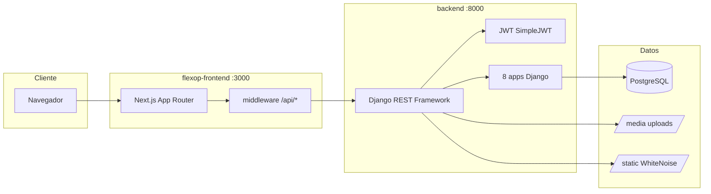

# Capítulo 3 — Arquitectura del sistema

[← Índice](./README.md) | [← Anterior](./02-estructura-repositorio.md) | [Siguiente: Backend →](./04-backend.md)

---

## Autenticación y autorización

- **Backend:** JWT (`rest_framework_simplejwt`) con refresh token, rotación y blacklist.
- **Frontend:** tokens en cookies (`flexop_access`, `flexop_refresh`); interceptor Axios renueva en 401.
- **Roles:** `OPERARIO`, `SUPERVISOR`, `GERENTE`, `ADMIN`.
- **Multitenancy:** mixin `EmpresaFilterMixin` filtra querysets por empresa del usuario; validación cruzada en serializers (`tenant_validation.py`).
- **Permisos:** módulo `usuarios/permissions.py` (`IsSupervisorOrAbove`, etc.).

## Paginación

- API: `PageNumberPagination`, **20 registros por página**.
- Frontend: componente `PaginationBar` en todos los listados principales.
