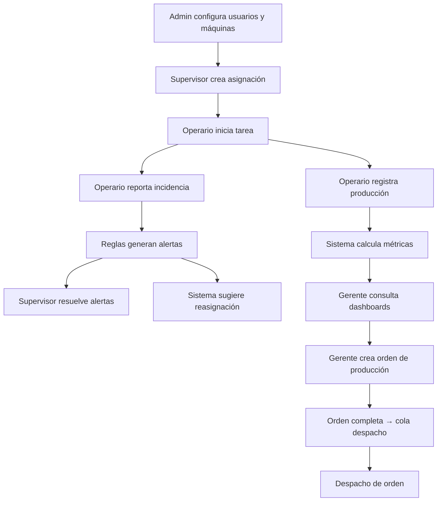

# Capítulo 10 — Flujo operativo simplificado

[← Índice](./README.md) | [← Anterior](./09-comandos-desarrollo.md) | [Siguiente: Calidad →](./11-calidad-mejoras.md)

---

```mermaid
flowchart TD
  A[Admin configura usuarios y máquinas] --> B[Supervisor crea asignación]
  B --> C[Operario inicia tarea]
  C --> D[Operario registra producción]
  C --> E[Operario reporta incidencia]
  D --> F[Sistema calcula métricas]
  E --> G[Reglas generan alertas]
  G --> H[Supervisor resuelve alertas]
  G --> I[Sistema sugiere reasignación]
  F --> J[Gerente consulta dashboards]
  J --> K[Gerente crea orden de producción]
  K --> L[Orden completa → cola despacho]
  L --> M[Despacho de orden]
```
